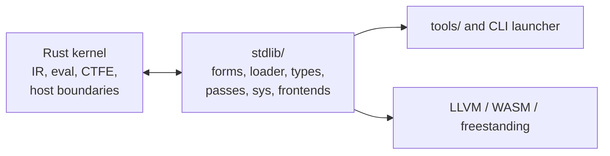

# CAAP

CAAP is a compiler platform built around a deliberately small semantic core.
The Rust kernel provides the evaluator, a three-node IR (`Name`, `Literal`,
`Call`), CTFE hooks, host-service boundaries, and the query/provider substrate.
Language policy lives above that substrate, mostly in `.caap` code under
[`stdlib/`](stdlib/): modules, forms, types and effects, passes, surface
grammars, sys facades, and LLVM/WASM code generation.

The central rule is simple: the kernel supplies mechanisms; the standard library
owns policy. A bare compiler session does not autoload language behavior. Run a
bootstrap when you want the stdlib tower.



## Repository Layout

| Path | Purpose |
| --- | --- |
| [`caap/`](caap/) | Core library (`caap-core`): IR, evaluator, compiler sessions, CTFE, semantic graph, host bridges, and runtime loading. |
| [`caap-cli/`](caap-cli/) | The `caap` command-line launcher and CLI scenario tests. |
| [`caap-lsp/`](caap-lsp/) / [`caap-dap/`](caap-dap/) | Editor analysis and debugger integrations backed by bootstrapped stdlib commands. |
| [`peg/`](peg/) | Standalone PEG/parser support crate (`caap-peg`). |
| [`peg-derive/`](peg-derive/) | Proc-macro support for the PEG crate. |
| [`caap-sys-runtime/`](caap-sys-runtime/) | Native system runtime catalog and host-service FFI boundary. |
| [`caap-sys-runtime-ffi/`](caap-sys-runtime-ffi/) | C ABI wrapper used by runtime boundary tests. |
| [`stdlib/`](stdlib/) | Active CAAP standard library: bootstrap, loader, forms, type/effect passes, sys facades, frontends, and native backends. |
| [`tools/`](tools/) | Small CAAP driver programs run under a bootstrap, such as `run.caap`, `s2_emit.caap`, and `s2_build.caap`. |
| [`examples/`](examples/) | Demonstrations, including the freestanding `urun` RTOS slice. |
| [`tests/`](tests/) | Negative and fixture `.caap` inputs consumed by Rust integration tests. |
| [`docs/`](docs/) | Architecture contracts, mechanism notes, design records, and testing documentation. |
| [`book/`](book/) | mdBook tutorial for first-time readers. |
| [`scripts/`](scripts/) | Local verification and maintenance gates. |
| [`vscode-caap/`](vscode-caap/) | VS Code extension package for syntax, LSP, and DAP integration. |

## Prerequisites

- Rust stable with `cargo`, `rustfmt`, and `clippy`.
- Optional: `clang` for hosted native builds.
- Optional: `ld.lld` and `qemu-system-arm` for freestanding Cortex-M/URun
  acceptance checks.

Native executable tests skip themselves when the required host tools are absent.

## Verify The Workspace

Run the normal local gate:

```bash
scripts/strict-gate.sh
```

That gate runs formatting, clippy, workspace tests, and doc tests:

```bash
cargo fmt --all -- --check
cargo clippy --workspace --all-targets -- -D warnings
cargo nextest run --workspace  # falls back to cargo test --workspace
cargo test --workspace --doc
```

Useful focused commands:

```bash
cargo test -p caap-core
cargo test -p caap-peg
cargo test -p caap-sys-runtime
cargo test -p caap-cli
```

Slower workflows are explicit:

```bash
scripts/test-acceptance.sh
scripts/production-gate.sh
```

## Run CAAP

The CLI is intentionally small:

```text
caap PROGRAM
caap BOOTSTRAP PROGRAM [ARG...]
```

The first form evaluates a program on the bare kernel. The second form executes
`BOOTSTRAP` first, then lets that bootstrap decide how to run `PROGRAM`.

Try the bare kernel:

```bash
printf '(int_add 2 3)\n' > five.caap
cargo run -p caap-cli -- five.caap
```

Run a stdlib-aware source file through the loader:

```bash
cargo run -p caap-cli -- stdlib/bootstrap.caap tools/run.caap PROGRAM.caap
```

Emit or build native code through the stdlib backend:

```bash
cargo run -p caap-cli -- stdlib/bootstrap.caap tools/s2_emit.caap FILE > out.ll
cargo run -p caap-cli -- stdlib/bootstrap.caap tools/s2_build.caap FILE OUTPUT
```

Use the bare policy for formatting and AST inspection:

```bash
cargo run -p caap-cli -- tools/bare.caap tools/canonicalize.caap FILE
cargo run -p caap-cli -- tools/bare.caap tools/ast_json.caap FILE
```

## Documentation Map

Start with [`docs/README.md`](docs/README.md) for the documentation audit,
status map, and "what should I read?" diagram. Use the mdBook in [`book/`](book/)
for a guided introduction. The most important active references are:

- [`docs/principles.md`](docs/principles.md) - non-negotiable architecture
  principles.
- [`docs/architecture.md`](docs/architecture.md) - current subsystem contracts
  and boundaries.
- [`docs/caap-spec.md`](docs/caap-spec.md) - audited language, stdlib, and
  toolchain specification.
- [`KERNEL_REFERENCE.md`](KERNEL_REFERENCE.md) - kernel builtin and CTFE
  reference.
- [`docs/builtins.md`](docs/builtins.md) - generated builtin catalog with
  arity, phase, and effect metadata.
- [`stdlib/README.md`](stdlib/README.md) - stdlib tower overview.
- [`stdlib/CONVENTIONS.md`](stdlib/CONVENTIONS.md) - rules for writing stdlib
  modules.
- [`docs/testing.md`](docs/testing.md) - test tiers and gate commands.
- [`docs/mechanisms/`](docs/mechanisms/) - focused mechanism references.

## Development Notes

- `Cargo.lock` is committed because the workspace ships runnable binaries and
  integration tests.
- Native executable builds cache generated C runtime artifacts under
  `.caap_build/`, which is ignored.
- Use `scripts/clean-local-artifacts.sh --dry-run` to inspect local generated
  artifacts. Add `--apply` for allowlisted removals and `--cargo-clean` only
  when you intentionally want to reclaim the large Cargo `target/` cache.
- Keep policy in stdlib unless a feature truly needs kernel substrate.
- Prefer explicit diagnostics over compatibility fallbacks.

## Contributing

Read [`CONTRIBUTING.md`](CONTRIBUTING.md), [`docs/principles.md`](docs/principles.md),
and [`docs/architecture.md`](docs/architecture.md) before non-trivial changes.
The definition-of-done gate is `scripts/strict-gate.sh`.

## Security

Do not open public issues for security vulnerabilities. Report them privately
following [`SECURITY.md`](SECURITY.md).

## Code Of Conduct

This project follows the [Contributor Covenant](CODE_OF_CONDUCT.md). By
participating, you agree to uphold it.

## License

Licensed under the Apache License, Version 2.0. A copy is available in
[`LICENSE`](LICENSE), and attribution is in [`NOTICE`](NOTICE).

Copyright 2026 The CAAP Authors.
