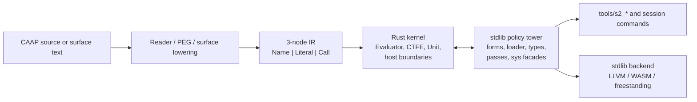

# CAAP Documentation Map

Status: reviewed against the repository tree on 2026-06-30.

This page is the documentation audit and navigation hub. It answers two
maintenance questions:

- which documents are active contracts, references, tutorials, or historical
  notes;
- why each group is still needed and how it should be kept current.

## How To Choose A Document

```mermaid
flowchart TD
  Start["What are you trying to do?"]
  Start --> Learn["Learn CAAP"]
  Start --> Change["Change behavior"]
  Start --> Stdlib["Work in stdlib"]
  Start --> Tooling["Work on tooling/backends"]
  Start --> History["Understand old decisions"]

  Learn --> Book["book/ mdBook tutorial"]
  Learn --> RootReadme["README.md quick start"]

  Change --> Principles["principles.md"]
  Change --> Architecture["architecture.md"]
  Change --> Spec["caap-spec.md"]
  Change --> Testing["testing.md"]

  Stdlib --> StdReadme["../stdlib/README.md"]
  Stdlib --> Conventions["../stdlib/CONVENTIONS.md"]
  Stdlib --> StdArch["stdlib-architecture.md"]
  Stdlib --> StdRef["stdlib-reference.md"]

  Tooling --> PegDocs["peg/ docs"]
  Tooling --> Mechanisms["mechanisms/"]
  Tooling --> HowTo["how-to/"]

  History --> Migration["../MIGRATION.md"]
  History --> DesignNotes["design-* and historical mechanism notes"]
```

## Active Architecture At A Glance

The key rule behind the map is still: core supplies mechanisms; `stdlib/` owns
language policy.

## Coverage By Tree

This audit covers the repository's documentation-bearing files as follows:

- Root docs: `README.md`, `CONTRIBUTING.md`, `SECURITY.md`,
  `CODE_OF_CONDUCT.md`, `KERNEL_REFERENCE.md`, `MIGRATION.md`, and `CLAUDE.md`.
- Active `docs/` contracts and references: `principles.md`, `architecture.md`,
  `caap-spec.md`, `builtins.md`, `stdlib-reference.md`,
  `stdlib-architecture.md`, `testing.md`, `perf-notes.md`,
  `kernel-musthave.md`, `segmental-reader.md`, design notes, and ADRs.
- `docs/how-to/`: freestanding target, C-like syntax, stdlib pass, and native
  head recipes.
- `docs/mechanisms/`: dual-phase execution, CTFE/surface forms, value/type
  model, surface grammar/lowering, codegen/LLVM, sys grant policy, bootstrap
  contract, registry ABI, session, prelude/hub stability, crypto policy, bare
  concurrency, and the historical provider/pass note.
- `docs/peg/`: PEG README, guide, specification, grammar syntax, and future
  incremental/typed AST notes.
- `book/src/`: the mdBook chapters listed in `book/src/SUMMARY.md`.
- `stdlib/`: the stdlib overview, conventions, roadmap, and domain READMEs
  under `lib/`, `syntax/`, `semantics/`, `sys/`, `backend/`, `storage/`, and
  `bare/`.
- Other package/example docs: `peg/README.md`, `tests/README.md`,
  `examples/urun/README.md`, and `vscode-caap/README.md`.

## Inventory And Necessity

| Document or group | Role | Status | Keep because | Maintenance rule |
|---|---|---|---|---|
| [../README.md](../README.md) | Project entry point | Active | Fast orientation, layout, verify/run commands | Keep concise; link outward instead of duplicating deep references. |
| [../CONTRIBUTING.md](../CONTRIBUTING.md) | Contributor workflow | Active | PR, test, and development expectations | Update when gates or workflow commands change. |
| [../SECURITY.md](../SECURITY.md) | Security policy | Active | Reporting and host-boundary guidance | Update with capability model changes. |
| [../CODE_OF_CONDUCT.md](../CODE_OF_CONDUCT.md) | Community policy | Active | Required project governance document | Keep standard text unless policy changes. |
| [../KERNEL_REFERENCE.md](../KERNEL_REFERENCE.md) | Kernel reference | Active | Human-readable CTFE/kernel surface detail | Keep aligned with `docs/builtins.md` and kernel tests. |
| [../MIGRATION.md](../MIGRATION.md) | Migration record | Historical, retained | Explains v1 removal and why old names are not current | Do not use for new workflows; keep clearly historical. |
| [../CLAUDE.md](../CLAUDE.md) | Agent/developer context | Internal support | Captures repo-specific working rules for local agents | Not a public contract; update only with working-practice changes. |
| [principles.md](principles.md) | Architecture principles | Active contract | Guards core-vs-stdlib ownership | Any architectural exception should mention which principle it affects. |
| [architecture.md](architecture.md) | System architecture | Active contract | Explains current subsystem boundaries | Update when ownership or execution paths change. |
| [caap-spec.md](caap-spec.md) | Normative short spec | Active contract | Most compact source of current language/stdlib/CLI behavior | Keep date current after audits; avoid historical names except in the final warning. |
| [builtins.md](builtins.md) | Builtin catalog | Generated/locked reference | Public builtin registry surface | Maintained with `builtins_doc_bijection_tests`; do not hand-wave counts. |
| [stdlib-reference.md](stdlib-reference.md) | Flat stdlib API table | Active reference | Quick lookup of modules and exports | Prefer pointers to domain READMEs for detail. |
| [stdlib-architecture.md](stdlib-architecture.md) | Deep stdlib architecture | Active reference | Full tower topology, boot, native, URun details | Update alongside meaningful stdlib module moves. |
| [testing.md](testing.md) | Test taxonomy | Active reference | Defines test tiers and gates | Update when harness names, tiers, or scripts change. |
| [perf-notes.md](perf-notes.md) | Performance investigation | Snapshot | Keeps measured compile/load findings and recommendations | Refresh numbers when the load path changes materially. |
| [kernel-musthave.md](kernel-musthave.md) | Kernel worklist | Volatile planning note | Captures ranked kernel gaps and done history | Review before using; move completed items promptly. |
| [adr-0001-specialization-budget.md](adr-0001-specialization-budget.md) | ADR | Accepted decision | Records specialization budget policy | Supersede with a new ADR instead of rewriting history. |
| [segmental-reader.md](segmental-reader.md) | Mechanism contract | Active | Reader directives and in-stream grammar extension | Update with frontend reader changes. |
| [design-capability-enforcement.md](design-capability-enforcement.md) | Design plus status | Active design record | Fine-grained `sys.*` capability rationale | Keep enforcement status synchronized with host/sys code. |
| [design-bare-metal.md](design-bare-metal.md) | Bare-metal audit/design | Active design record | Explains Cortex-M/URun layering and why core stayed small | Keep names in `stdlib.frontend.*` / `stdlib.backend.*`, not old `kits.*`. |
| [design-partial-evaluation.md](design-partial-evaluation.md) | Design note | Historical with active mechanisms | Explains PE model beyond current implementation | Keep status banner; point active behavior to spec/mechanisms. |
| [design-oop.md](design-oop.md) | Design note | Historical | Records possible OOP layer without claiming support | Keep only as design background. |
| [name-first-expression-only-grammar.md](name-first-expression-only-grammar.md) | Design note | Historical | Records a superseded surface experiment | Keep historical banner; do not use as active surface guide. |
| [how-to/](how-to/) | Contributor recipes | Active how-to | Focused edit paths for freestanding targets, C-like syntax, stdlib passes, native heads | Update exact commands when affected tests or files move. |
| [mechanisms/](mechanisms/) | Conceptual references | Mixed active/historical | Focused explanations of CTFE, phases, sys grants, surfaces, codegen, bare concurrency | Each page must state if it is active or historical. |
| [peg/](peg/) | PEG reference set | Active for `caap-peg` | Grammar syntax, guide, specification, future AST notes | Keep in sync with `peg/` tests and public API. |
| [../book/](../book/) | mdBook tutorial | Active tutorial | First-time reader path through the language | Keep examples runnable and avoid design-only details. |
| [../stdlib/README.md](../stdlib/README.md) and [../stdlib/CONVENTIONS.md](../stdlib/CONVENTIONS.md) | Stdlib overview and rules | Active | Main stdlib authoring entry points | Update with loader, module, or tier-policy changes. |
| `../stdlib/**/README.md` | Domain READMEs | Active references | Local module-family docs near implementation | Keep scoped to each directory; avoid copying the full stdlib reference. |
| [../stdlib/ROADMAP.md](../stdlib/ROADMAP.md) | Stdlib planning | Volatile roadmap | Tracks done and deferred stdlib work | Review before treating an item as still open. |
| [../peg/README.md](../peg/README.md) | Crate README | Active | Public parser crate overview and checks | Keep with `caap-peg` API changes. |
| [../tests/README.md](../tests/README.md) | Fixture warning | Active | Prevents negative fixtures from being read as examples | Keep short and prominent. |
| [../examples/urun/README.md](../examples/urun/README.md) | Example guide | Active | Explains the freestanding URun slice | Keep with URun build/test behavior. |
| [../vscode-caap/README.md](../vscode-caap/README.md) | Extension README | Active | Editor extension build/settings/limits | Update with package settings and LSP/DAP behavior. |

## Audit Findings From 2026-06-30

- No document group is currently a deletion candidate. Historical files are
  still useful, but they must stay clearly marked as historical.
- `docs/caap-spec.md` is the active short contract and now distinguishes the
  active `stdlib/bootstrap.caap` workflow from removed v1 tools.
- Bare-metal docs and the native chapter now use active `stdlib.backend.*` and
  `stdlib.frontend.*` names instead of the removed `kits.*` names.
- `docs/mechanisms/provider-pass-pipeline.md` remains useful as a historical v1
  mechanism note, but the mechanisms index now labels it that way.
- The `stdlib.sys.wrap` reference now includes `make_facade`, matching the
  actual export list.

## Documentation Rules

1. Active contracts should say what exists now, not what is planned.
2. Historical notes must say so in the first screen of the file.
3. Generated or lock-tested references must name their guard tests.
4. Avoid duplicating long API catalogs; link to the closest reference instead.
5. When a path, tool, module name, or bootstrap changes, update this map in the
   same change.
