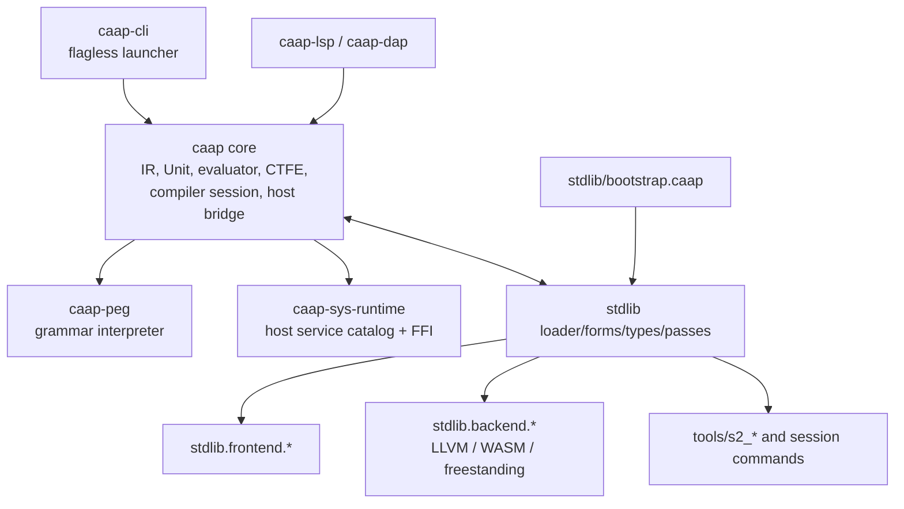

# CAAP Architecture

This document describes the concrete architecture of CAAP: what exists, how the
pieces fit together, and which layer owns which policy. For the deeper "why",
see [`principles.md`](principles.md). For the audited language/stdlib/toolchain
contract, see [`caap-spec.md`](caap-spec.md).

## Document Status

This is an architecture contract, not a wish list. If an implementation lacks a
piece described here, it must either implement it or make the absence explicit
with an error, diagnostic, or test. A demo-only shim that changes semantics is
not an acceptable substitute.

The most important boundary is:

```text
core = substrate
stdlib = policy
```

Core may expose adapters so stdlib code can control the compiler, but those
adapters must not become another implementation of module, type, effect, or
codegen policy.

## Layered View

```text
caap-cli
  flagless launcher: caap BOOTSTRAP PROGRAM [ARG...]

stdlib
  loader, modules, forms, types/effects, passes, sys facades,
  frontends, native/WASM backend policy

bootstrap execution
  stdlib/bootstrap.caap builds the session explicitly

compiler session
  query engine, provider pipeline, registry, artifact cache

Unit
  IR, semantics, attributes, syntax state, links, snapshots, transactions

Evaluator
  runtime and compile-time execution with phase/effect checks

IR
  Name | Literal | Call

Surface layer
  ParsedForm, lowering, reader directives

PEG
  standalone grammar interpreter
```

The same ownership as a graph:



## PEG Parser

The PEG crate is a grammar interpreter. It consumes a `Grammar` data structure
and source text and produces an AST trace:

```text
Grammar + source text -> AstNode { rule, span, children }
```

A grammar is first-class data. It can be inspected, mutated, serialized,
deserialized, analyzed, cached, and sealed.

PEG does not know about CAAP modules, CTFE, sys capabilities, or LLVM. If PEG
starts depending on CAAP semantics, the boundary has been broken.

### Why Interpret Grammars

CAAP interprets grammar data at runtime instead of generating a parser ahead of
time. This costs more per cold parse, but enables:

- runtime grammar extension;
- grammar patching from stdlib or user policy;
- grammar introspection and analysis as data;
- editor/tooling scenarios that need grammar mutation.

### Semantic Hooks

PEG supports `Behavior` and `TransformBehavior` callbacks. CAAP surface layers
use those hooks to turn raw parse trees into typed `ParsedForm` values and then
lower them into IR.

### Grammar Introspection

CAAP exposes grammar tooling through CTFE data projections:

- `ctfe_grammar_describe`
- `ctfe_grammar_rule_get`
- `ctfe_grammar_analyze`
- `ctfe_grammar_conflicts`

Providers and stdlib code should consume these reports instead of parsing rule
text or duplicating PEG analysis logic.

### Scannerless And Token-Stream Parsing

Default parsing is scannerless: literals, regexes, and character classes operate
directly on source text. Token-stream parsing is explicit and data-driven:

- `ctfe_lexer_tokenize` creates token maps from ordered regex specs.
- `ctfe_lex_token` creates one token map.
- `ctfe_grammar_parse_tokens` parses with explicit `LexToken` data and `tok(...)`
  grammar rules.

Lexer policy is constructed outside `caap_peg` and passed in as data.

### Memoization Policy

Packrat memoization is enabled by default. CTFE parse options expose the policy:

- `"memo"` enables/disables memoization.
- `"memo_policy"` with `"global_budget"` caps memo entries.
- `"max_steps"` controls the parse step budget.
- `"return_spans"` requests span-preserving output where supported.

Left-recursive grammars require memoization; disabling memoization for such a
grammar is rejected before parse execution.

## IR

CAAP IR has exactly three node kinds:

```text
NameNode    { id, identifier }
LiteralNode { id, value }
CallNode    { id, callee, args }
```

`IrLiteralData` covers `Null`, `Bool`, `Int`, `Float`, `Str`, `Tuple`, and
`Dict`.

Everything structured is a call:

```lisp
(if a b c)       ; Call(Name("if"), [a, b, c])
(lambda (x) x)   ; Call(Name("lambda"), [params, body])
(int_add 1 2)    ; Call(Name("int_add"), [1, 2])
```

There is no special IR node for `if`, lambda, binary operators, loops, modules,
or pattern matching.

### IRGraph

`IRGraph` stores nodes, parent links, source spans, and ordered top-level forms.
Where order can affect snapshots, diagnostics, or generated output, the
implementation must use a stable order.

### IRGraphTemplate

`IRGraphTemplate` is the deterministic serialized/snapshot form of a graph. It
is used for diffing, restoration, caching, and source-template reuse.

## Unit

`Unit` is the composition root for one compilation unit:

```text
Unit {
  unit_id
  ir
  semantics
  attrs
  syntax
  identity
  links
  snapshots
  transactions
}
```

A unit is not a module. It does not own import/export/reexport policy. The
stdlib loader does.

The unit is responsible for:

- IR storage and mutation tracking;
- facts, symbols, attributes, syntax metadata, and link substrate;
- stable identity, snapshots, templates, and transactions;
- provider-readable and provider-writable state through explicit APIs.

The unit is not responsible for:

- module roots or import/export behavior;
- choosing codegen targets;
- purity/type/effect policy without registered providers or stdlib contracts;
- project dependency semantics.

### Snapshots And Transactions

Unit mutations can be wrapped in transactions. A provider can begin a
transaction, attempt rewrites, and then commit or roll back. Provider contexts
should expose safe operations rather than raw `&mut Unit` access.

## Semantic State

Unit semantic state is a layered graph:

```text
UnifiedSemanticGraph {
  symbols
  semantics
  facts
  stable_ids
  cell_generations
}
```

- `symbols`: public semantic entries such as callable names and policy metadata.
- `semantics`: resolved semantic entries and bindings.
- `facts`: versioned `(subject, predicate, value)` triples.
- `stable_ids`: deterministic identity for nodes and semantic entries.
- `cell_generations`: fine-grained invalidation counters.

Passes and providers should communicate through facts and typed provider
contracts, not through hidden global side channels.

## Provider Pipeline And Query Engine

Compilation is query-driven. A query asks for an artifact; the engine finds
providers, resolves their dependencies, runs them in dependency order, and
caches results.

### Stages And Providers

A provider is a typed compilation edge. It declares:

- source/target stage or artifact target;
- phase (`runtime`, `compile_time`, or `dual`);
- effect tags such as `write_ir`, `emit_diagnostics`, or `request_restart`;
- storage reads/writes over kernel domains (`ir`, `facts`, `symbols`,
  `attributes`, diagnostics, cache, registry);
- scheduling dependencies through explicit data keys;
- structured success/failure output.

A provider that mutates IR without `write_ir`, emits diagnostics without the
right effect tag, or requests restart without `request_restart` violates the
contract even if the visible output happens to look correct.

CAAP-defined provider callbacks use a context-first ABI such as
`(lambda (ctx root) ...)`. They do not receive implicit compiler or unit handles.
All unit access goes through provider primitives.

### Why Queries

An imperative pipeline fixes order globally. A query pipeline orders work by
declared dependencies. That enables lazy computation, incremental rebuilds, and
future parallel execution of independent providers.

## Dual-Phase Evaluation

The evaluator can execute code in `RUNTIME` or `COMPILE_TIME` phase.

- `PhasePolicy.DUAL`: callable may run in either phase.
- `PhasePolicy.COMPILE_TIME`: callable is compile-time only, usually `ctfe-*`.
- `PhasePolicy.RUNTIME`: callable is runtime only, such as runtime sys calls.

Dispatch checks phase before executing a callable.

`PhasePolicy.DUAL` is not partial evaluation. It is a per-symbol permission that
a callable may run in either phase. Per-call-site binding-time analysis and
residual specialization are a separate mechanism described in
[`design-partial-evaluation.md`](design-partial-evaluation.md).

### Dynamic Effect Attenuation

`effect_scope` can drop privileges around untrusted callbacks:

```lisp
(effect_scope (list_of "read_ir")
  (untrusted_macro input))
```

Nested scopes may only request subsets of the parent effect set. An empty effect
set is pure-only execution.

`effect_scope` also installs a default allocation budget when none is active, so
untrusted pure allocation loops fail cleanly instead of exhausting host memory.
CPU bounding outside CTFE fold remains the embedder's responsibility.

### Runtime Syntax Macros

`macro` constructs runtime syntax transformers. Macro arguments are quoted into
detached syntax values before binding, and the macro returns syntax that is
expanded and evaluated in the caller environment.

Syntax values are built and inspected with `syntax_name`, `syntax_literal`,
`syntax_call`, `syntax_kind`, `syntax_name_identifier`,
`syntax_literal_value`, `syntax_call_callee`, and `syntax_call_args`.

### Lexical Addressing

Runtime environments are slot-addressed frames. The evaluator caches resolved
`NameNode` addresses as `(depth, slot)` after lookup. If a cached outer address
becomes shadowed by a closer frame, lookup falls back to normal resolution and
refreshes the cache.

Qualified names still use dynamic map suffix resolution after exact binding
lookup; `module.member` is value lookup, not a separate namespace primitive.

## CTFE

CTFE is ordinary CAAP execution in compile-time phase. It is not a second
language.

Compile-time code can use `ctfe-*` builtins for:

- IR node inspection;
- declarative node matching;
- IR mutation in provider context;
- node rewrite with provenance;
- unit symbol registration;
- builtin semantic vocabulary projection;
- compiler registry value registration;
- stage and provider registration;
- annotations and facts.

Syntax hooks are also CTFE callbacks: they receive partially parsed surface data
and return IR or surface forms.

### CTFE Isolation

CTFE has strong powers, so boundaries must be explicit:

- IR access goes through `ctfe-*` APIs.
- Host services go through phase and capability policy.
- Diagnostics should carry source spans or explicit subjects.
- Bootstrap-time state changes must be reproducible from the same bootstrap
  input.
- Native provider callbacks do not expose raw mutable compiler/unit handles.
- Provider effects are typed contracts (`EffectTag` / `EffectSet`), normalized at
  the CAAP boundary.

CTFE is not an escape hatch for arbitrary host code.

## Bootstrap Execution

Bootstrap is sequential CTFE execution that builds the session:

```text
CompilerHost.new_session()
  -> empty compiler session

execute stdlib/bootstrap.caap
  -> boot expander/forms
  -> checker and loader
  -> module resolver
  -> foundational libraries
  -> type/effect policy
  -> session commands

result: bootstrapped compiler host with stdlib module system ready
```

Bootstrap files are ordinary CAAP code executed in compile-time phase.

## Module System

The module system lives in `stdlib/boot/loader.caap` and
`stdlib/lib/project.caap`.

Core provides:

- unit registration;
- query/evaluation APIs for loading source;
- cross-unit link substrate;
- compiler registry for runtime closures.

Stdlib owns:

- `import`, `use`, `re_export`, and `export` semantics;
- `declare`, `declare_root`, and `discover`;
- project manifests with roots, dependencies, and entry points;
- public symbol resolution;
- surface protocol dispatch.

When running:

```bash
caap stdlib/bootstrap.caap program.caap [args...]
```

the CLI executes the bootstrap, looks up `cli.main` or the session command map,
and delegates program behavior to stdlib policy.

CLI adapters may pass paths, args, and session handles to bootstrapped commands.
They must not parse module policy, duplicate dependency ordering, or bypass the
stdlib loader.

## Surface Syntax And Reader Directives

Surface syntax flows through:

```text
source text
  -> PEG
  -> raw AST
  -> semantic hooks
  -> ParsedForm
  -> lowering
  -> IRGraph
```

Full surface extensions use grammar rules plus semantic hooks and lowering.
Lightweight in-stream reader directives are specified in
[`segmental-reader.md`](segmental-reader.md):

- `(extend_syntax "rule" "peg-source")`
- `(define_grammar "name" "rule" "peg-source")`
- `(begin_scope "name") ... (end_scope)`

Reader directives affect only later top-level forms, are consumed by the reader,
and preserve whole-program semantics after collection.

## Workflow And State-Machine Semantics

Workflow/state-machine behavior should be implemented as a CAAP kit, not as a
kernel primitive.

The kernel already provides maps, lists, callables, CTFE, module loading, and
diagnostics. A stdlib or user kit should provide builders, grammar metadata,
effect/capability validation, transition graph validation, and diagnostics.

No `StateNode` or evaluator branch is needed. Invalid workflow definitions can
fail during CTFE validation.

## Host Services And Capabilities

System capabilities are registered through `HostServiceRegistry`:

```text
HostServiceRegistry {
  services: Map<(library, name, phase), HostServiceExport>
}
```

Bootstrap or embedder policy grants selected capabilities through
`HostCapabilityPolicy`.

Runtime code accesses services only through explicit module imports and granted
facades. Compile-time providers may use compile-time services only when their
metadata declares the required effect/capability.

There is no ambient `read_file` builtin. Use typed sys facades, capability
policy, or trusted bootstrap/tooling exports.

Runtime plugins perform an ABI descriptor handshake before catalog or invoke:
ABI version, value encoding version, catalog schema version, required symbol
hash, and capability/effect catalog hash. Mismatches are rejected before export
registration.

## Diagnostics And Trace

Observable compiler behavior includes:

- structured diagnostics: code, severity, message, source span, optional notes;
- compile trace: event kind, source/target, phase, cache status, elapsed time
  for expensive steps;
- provider events: start, finish, cache hit, restart;
- bootstrap events: executed file, image restore/store, capability context.

Any new public compiler behavior visible through CLI/API should have a test that
checks either output or diagnostic/trace contract.

## Artifact Cache And Incremental Compilation

The artifact cache stores:

- key: hierarchical `ArtifactKey`;
- value: fingerprint plus payload;
- dependencies: explicit artifact dependency graph.

When source changes, dependent artifacts become dirty and the query engine
recomputes only what is needed.

The source-template cache separately stores parsed/lowered unit templates by
source fingerprint so unchanged parsing/lowering work can be reused.

## Backend And Codegen

Codegen lives in `stdlib/backend/*` and is lazy-loaded. The conceptual pipeline
is:

```text
lower -> declare -> prep -> emit -> link
```

Important contracts:

- `stdlib.backend.native_meta` is the single vocabulary source for native heads
  and native types.
- `prep.caap` derives the pre-codegen gate from native metadata.
- WASM derives its unsupported LLVM-only set from the same metadata.
- `prep.caap` has an opt-in strict native profile that rejects declared type
  tokens not known to native metadata or program struct/union declarations.
- `driver.caap` offers one-call helpers for freestanding C-like surface builds,
  including the URun path.

## Parse-To-Eval Sketch

```text
"(if (eq x 0) (do ...) ...)"
  -> PEG parse
  -> ParsedForm
  -> IRGraph
  -> evaluator lookup of callee "if"
  -> LazyIf policy evaluates condition first
  -> RuntimeValue
```

## Query Sketch

```text
query(unit, target="resolved")
  -> find providers for target
  -> resolve dependencies
  -> check provider caches
  -> run callbacks through provider context
  -> store artifacts
  -> unit reaches requested state
```
