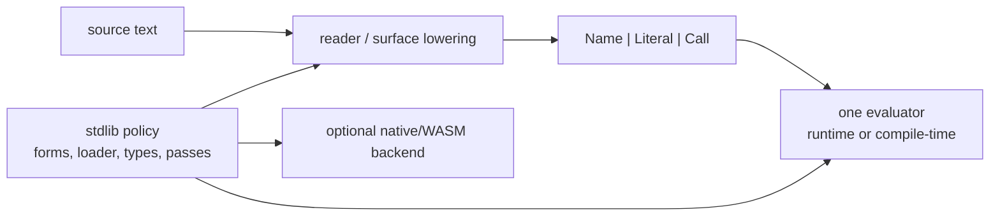

# CAAP Specification

Status: audited against the current tree on 2026-06-30. This is the short
normative map for the active implementation. Historical v1 material lives in
`MIGRATION.md` and older design notes; it is not the active standard library.

## 1. Core Model

CAAP source lowers to an IR with exactly three node kinds:

| IR node | Meaning |
|---|---|
| `Name` | identifier reference |
| `Literal` | scalar or runtime value literal |
| `Call` | callee node plus argument nodes |

The same evaluator runs compile-time and runtime code. Phase policy controls
where a symbol may execute:

| Policy | Meaning |
|---|---|
| `Runtime` | callable only at runtime |
| `CompileTime` | callable only during compiler execution |
| `Dual` | callable in either phase |

Partial evaluation is implemented as ordinary compile-time evaluation under
budgets. A failed opportunistic fold falls back to runtime unless a surface form
or checker explicitly requires compile-time evaluation.



## 2. Kernel Surface Syntax

The built-in reader parses a sequence of forms:

| Form | Contract |
|---|---|
| integer | signed decimal `i64` |
| float | decimal/exponent literal parsed as `f64` when the token contains `.`, `e`, or `E` |
| string | JSON-style escaped string |
| boolean | `true` / `false` |
| null | `null` |
| symbol | `[A-Za-z_+\-*\/<>=!?$%&:.][A-Za-z0-9_+\-*\/<>=!?$%&:.]*` |
| list | `(head arg...)`; empty list is `null` |

Trivia is whitespace plus `;` line comments and `#|...|#` / `/*...*/` block
comments. The parser rejects pathological bracket nesting before recursive
descent can overflow the native stack.

Frontend-lowered special heads:

| Head | Lowering rule |
|---|---|
| `lambda` | `(lambda params body...)`; params may be a list, a dotted rest tail, or a bare rest symbol |
| `bind` | paired `((n v)...)` form lowers to lexical bindings; flat `(bind n v body...)` remains the define-like runtime form |
| `block` / `leave` | structured exits with symbol or string labels |
| `set!` | lexical assignment to the nearest enclosing mutable binding |

`set` is collection mutation, not lexical assignment. `(set name value)` is
rejected with a diagnostic telling the author to use `set!`.

## 3. Segmental Reader

The kernel can read a file one top-level form at a time. The default directive
set is recognized by inspection, not evaluation, and affects only following
forms:

| Directive | Effect |
|---|---|
| `(extend_syntax "rule" "peg")` | replaces a rule in the active grammar |
| `(define_grammar "name" "rule" "peg")` | registers or extends a named grammar |
| `(begin_scope "name")` | pushes the active grammar and switches to the named grammar |
| `(end_scope)` | restores the previous grammar |

Unbalanced `begin_scope` / `end_scope` is a parse error. A source with no
directive trigger takes the whole-file fast path.

## 4. stdlib Module Language

`stdlib/bootstrap.caap` is the active standard-library bootstrap. Modules are
ordinary CAAP files read by `stdlib.boot.loader`:

```lisp
(module stdlib.examples.app)
(import stdlib.lib.collections.sequence seq)
(use stdlib.lib.core.math abs clamp)
(re_export stdlib.lib.collections.option some none)

(defn main () int 42)
(export main)
```

Directive arguments are names, not string literals. Strings are data only.

| Directive | Meaning |
|---|---|
| `(module name)` | module identity |
| `(import mod alias)` | binds the full export map under `alias` |
| `(use mod a b)` | binds selected exports directly in scope |
| `(re_export mod a b)` | imports and exports selected names |
| `(export a b)` | explicit public contract; omitted exports make the last body value the module result |

The loader resolves modules by explicit declaration, `declare_root` naming
convention, or recursive `discover`. It supports dependency cycles by publishing
an empty export map before building a module; cross-cycle references must be
delayed into function bodies.

Load pipeline:

```text
read -> expand forms -> semantic check -> type/effect check -> eval
```

All pre-eval diagnostics are located at the top-level source form.

## 5. stdlib Surface Forms

`stdlib/boot/forms.caap` defines the policy layer over the kernel:

| Form | Contract |
|---|---|
| `cond`, `when`, `unless`, `case`, `if_let`, `when_let` | control-flow sugar that expands before checking |
| `->`, `->>` | threading forms |
| `for` | sequence iteration over `sequence_each` |
| `const` | compile-time evaluation with a proof of purity |
| `defn` | function binding with name-attached signature and optional effect declaration |
| `struct` | typed aggregate plus generated `make_Type` constructor |
| `alias` | type alias |
| `enum` | named integer constants under an alias-like type |
| `union` | native-only overlapping storage |

The kernel forms `while`, `match`, `and`, `or`, `bind`, `ref`, `deref`,
`set_ref`, `try`, `catch`, `throw`, `block`, and `leave` are not redefined by
stdlib.

## 6. Types And Effects

The active type layer is `stdlib/semantics/types`:

| Module | Role |
|---|---|
| `registry.caap` | primitive, sized, pointer, struct, alias, enum, and generic type descriptors |
| `records.caap` | inert markers emitted by forms |
| `effects.caap` | effect-tag inference and ownership analysis |
| `infer.caap` | type/effect walker and module signature store |

Signatures live at names, so imports carry type and effect information across
module boundaries. Sized integer literals are range-checked. Branches in `if`
and `match` are joined. Plain lambda bindings and builtin facades can receive
inferred signatures when enough information is certain.

Effects are tags, not a binary flag. Mutating state freshly allocated inside a
function is not an escaping mutation effect; mutating parameters or free names
is. Declared effects are verified overrides.

## 7. Surface Protocol

A file may begin with:

```lisp
(surface stdlib.frontend.clike)
```

or a kit-specific named variant such as `(surface stdlib.frontend.clike name)`.
The loader reads the file text, loads the kit, calls `lower_program` or
`lower_program_at`, and feeds the produced specs through the same expand,
check, type, eval, and native-prep pipeline. LSP analysis uses the same command
surface through `caap.session.commands`.

`stdlib.frontend.surface` is the lower-level grammar authoring kit: it builds PEG
source, parses arbitrary text with `ctfe_grammar_parse_forms`, and converts
parsed forms into stdlib expression specs.

## 8. Native Toolchain

The current native path is stdlib-owned:

| File | Purpose |
|---|---|
| `stdlib/backend/prep.caap` | prep one translation unit from stdlib source |
| `stdlib/backend/emit/llvm.caap` | emit LLVM IR from the typed native subset |
| `stdlib/backend/driver.caap` | compile/link LLVM through clang and the runtime FFI library |
| `stdlib/boot/native_emit.caap` | lazily loads/registers native emitters |
| `tools/s2_emit.caap` | CLI program: emit LLVM text |
| `tools/s2_build.caap` | CLI program: build executable |

Supported native subset includes typed `defn`, sized integers/floats, structs,
strings through runtime ABI, `if`, `while`, `bind`, `ref`/`deref`/`set_ref`,
bit operations, casts, globals, extern calls, typed pointers, fixed arrays,
function pointers, MMIO, inline asm, and freestanding object emission.

## 9. CLI Contract

The CLI has no subcommands:

```text
caap PROGRAM
caap BOOTSTRAP PROGRAM [ARG...]
```

`caap PROGRAM` evaluates on the bare kernel; non-`null` results are printed and
successful bare evaluation exits `0`. `caap BOOTSTRAP PROGRAM [ARG...]` executes
the bootstrap with `sys` authority, then calls registered `cli.main` as
`(cli.main program args)`. If no `cli.main` exists, it evaluates `PROGRAM` as a
bootstrap-style script. In launcher mode, `null` exits 0, an integer result
becomes the process exit code masked to one byte, and other non-null values print
to stdout.

## 10. Audit Conclusions

The v1 stdlib and v1 build tools are removed from the active implementation.
Active workflows should use `stdlib/bootstrap.caap` plus the current `tools/s2_*`
drivers or stdlib session commands.

Do not document new workflows in terms of `tools/build.caap`,
`tools/emit_llvm.caap`, `stdlib.pass_kit`, `stdlib.compiler_kit`,
`stdlib.surface_builder`, string-based module directives, or removed `kits.*`
names unless the document is explicitly historical.
