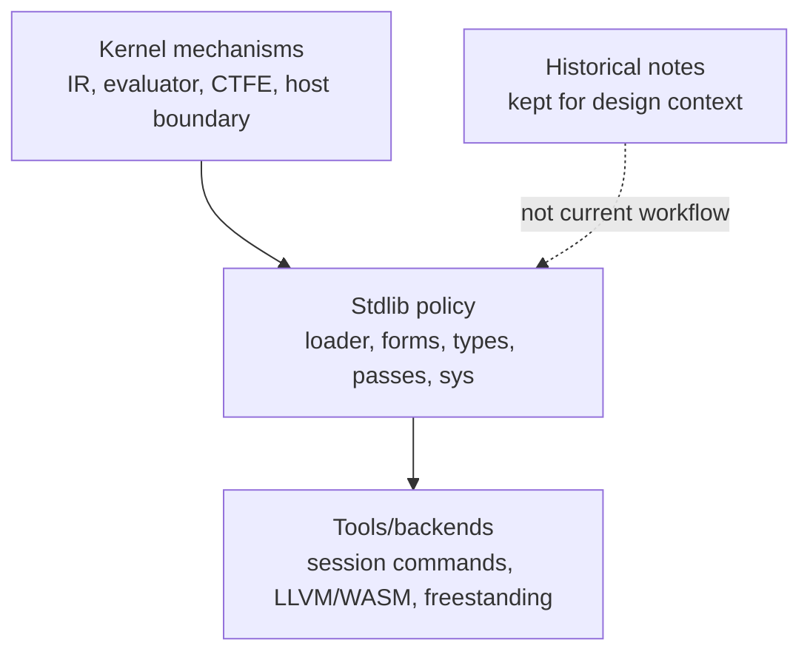

# CAAP Mechanisms — Conceptual Reference

These pages document the **mechanisms** the CAAP core (kernel) and standard
library provide — the load-bearing concepts you compose programs and compiler
extensions from. They are companions to the flat symbol references:

- [Kernel builtins reference](../builtins.md) — every kernel primitive (arity, phase, source).
- [Stdlib reference](../stdlib-reference.md) — every stdlib module and its public exports.
- [Current CAAP specification](../caap-spec.md) — audited active language and
  stdlib contract.

Every claim here is grounded in a source location (`file:symbol`). Where a
detail is inferred from usage rather than a definition, it is marked
**⚠ unconfirmed**.

## The mechanisms

| Page | What it covers |
|---|---|
| [Dual-phase execution](dual-phase-execution.md) | One evaluator, two phases (compile-time / runtime); `PhasePolicy`; partial evaluation as the unifying frame. |
| [Provider & pass pipeline](provider-pass-pipeline.md) | Historical v1 provider pipeline note. For active load-time passes, use [`../../stdlib/semantics/passes/README.md`](../../stdlib/semantics/passes/README.md) and [`../stdlib-architecture.md`](../stdlib-architecture.md). |
| [Surface grammar & lowering](surface-grammar-and-lowering.md) | PEG grammars, syntax authoring, trivia, surface→canonical lowering hooks. |
| [CTFE & surface forms](ctfe-and-surface-forms.md) | Compile-time evaluation primitives, IR node inspection/synthesis, surface-form manipulation, annotations & facts. |
| [Value & type model](value-and-type-model.md) | `RuntimeValue`, `value_type`, the IR `Node` model, and the stdlib `types` layer. |
| [Codegen / LLVM interface](codegen-llvm-interface.md) | The native head/type codegen contract and the `stdlib.backend.emit.llvm` lowering layer. |
| [`stdlib.bare` concurrency](stdlib-bare-concurrency.md) | The bare-metal concurrency contract: normal-return scope of `with_critical`, single-core vs multi-core exclusion, the atomic CAS-loop's tail-call reliance, the ARM-only/portable target matrix, and the native-only import rule. |

## The one-sentence model

CAAP is an S-expression language whose IR has exactly **three node kinds** —
`Name`, `Literal`, `Call` ([ir.rs](../../caap/src/ir.rs)) — evaluated by a single
tree-walking evaluator ([eval.rs](../../caap/src/eval.rs)) in one of two phases.
The active compiler policy is ordinary CAAP code in [stdlib](../../stdlib/):
the loader expands forms, runs semantic/type/effect passes, and hands the same
program to eval, analysis, or native prep. "Compiler as a Platform" means the
same primitives that run user code also build the compiler.
