# CAAP stdlib architecture

Status: current architecture snapshot of the active [`stdlib/`](../stdlib/) as
of 2026-06-23. The repository component is named `stdlib`, so this document uses
that name consistently.

This document answers four questions:

- what exists in stdlib and what each module owns;
- what public API each library/module exposes;
- what direct dependencies each module has;
- what runs when, and who triggers it: bootstrap, load, tooling, sys grants, and
  codegen.

Tests under `stdlib/lib/tests/test_*.caap` are not included in the API catalog:
they consume the library and are not part of the runtime/import surface.

## Executive Summary

`stdlib` is CAAP's policy layer over the minimal kernel/evaluator. The kernel
provides IR, the evaluator, CTFE, host-service primitives, and builtin
vocabulary. `stdlib` defines how that substrate becomes a user-facing language:
forms, modules, types/effects, sys facades, surface syntax, analyses,
optimizations, and codegen.

Main invariants:

- A form is a compile-time function `(ctx node) -> node`, not a textual macro.
- The loader runs `read -> expand -> transforms -> check -> typecheck -> passes -> eval`.
- All pre-eval phases run per top-level form, so diagnostics carry
  `path:line:col`.
- Module directives take names, not strings: `(use stdlib.x f)`, not
  `(use "stdlib.x" "f")`.
- Modules with `(module name)` publish an export map; value-shaped files without
  `(module ...)` return their final value.
- Type/effect/pass policy lives in stdlib, not in the kernel.
- The codegen layer is lazy: normal bootstrap does not load LLVM/WASM/frontend drivers.
- `sys/*` facades are typed and declaration-only without an explicit grant.
- `bare/*` is a native-only wrapper layer, not intended for plain CTFE/eval load.

## Topology

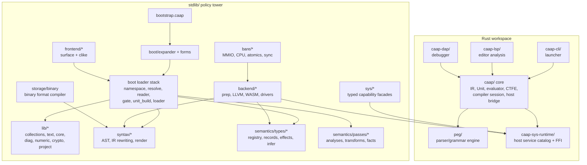

## Tier Model

| Tier | Code | Responsibility | Loaded by base bootstrap |
|---|---|---|---|
| 0 | `boot/expander.caap` | bare seed: form registry and recursive expansion engine | yes, raw bootstrap execute |
| 1 | `boot/forms.caap` | stdlib forms: `const`, `cond`, `defn`, `struct`, `enum`, etc. | yes, raw bootstrap execute |
| 2 | `boot/check.caap`, loader components, core lib ground | semantic check and module machinery written through the expander | yes |
| 3 | `boot/loader.caap`, `boot/commands.caap` | named modules, roots/discovery, load cache, session commands | yes |
| 4 | `semantics/types/*` | type descriptors, inert records, effect inference, type walker | yes |
| 5 | `semantics/passes/*`, `syntax/ir`, `backend/*`, `frontend/*`, `storage/*`, `bare/*` | optional passes, codegen, custom surfaces, native/bare tooling | lazy or explicit |

The tier rule: a module may depend only on lower or same tier policy. Upward
edges are architectural smell and are checked by `stdlib.semantics.passes.tiers`.

## Bootstrap Lifecycle

Base bootstrap file: [`stdlib/bootstrap.caap`](../stdlib/bootstrap.caap).

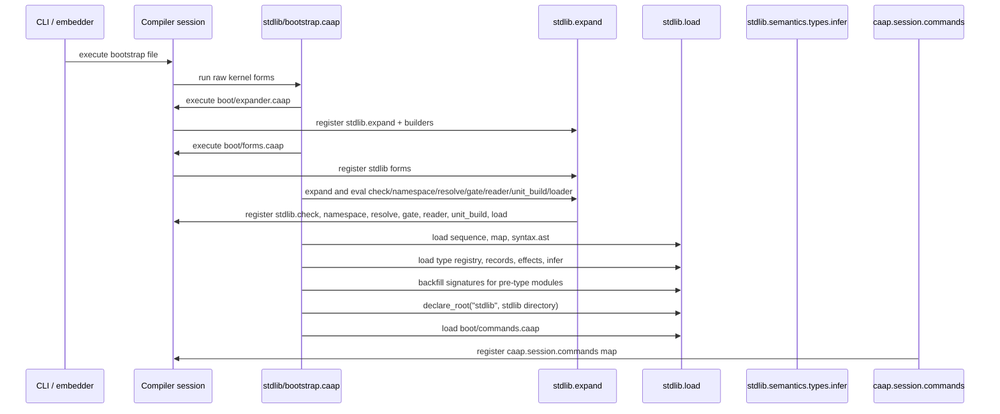

Exact base-bootstrap order:

1. Execute `boot/expander.caap` raw. It registers `stdlib.expand` and
   `stdlib.expand.builders`.
2. Execute `boot/forms.caap` raw. It registers sugar forms in `stdlib.expand`.
3. Run the remaining boot files through `expand` and then `ctfe_eval_node`:
   `check`, `namespace`, `resolve`, `gate`, `reader`, `unit_build`, `loader`.
4. Use `stdlib.load.load` to load bootstrap groundwork:
   `lib/collections/sequence`, `lib/collections/map`, `syntax/ast`.
5. Load the type layer:
   `semantics/types/registry`, `records`, `effects`, `infer`.
6. Run `backfill_types` for the groundwork loaded before `infer` existed.
7. Self-declare the `stdlib` root by deriving it from the canonical path of
   `stdlib.lib.collections.sequence`.
8. Load `boot/commands.caap`, which registers `caap.session.commands`.

## Module Load Pipeline

The loader is split into reusable boot modules but orchestrated by
`boot/loader.caap`.

```mermaid
flowchart LR
  File[".caap file"] --> Reader["reader\nsurface header?\nparse/lower to located specs"]
  Reader --> Directives["scan directives\nmodule/import/use/re_export/export"]
  Directives --> Imports["resolve imports\nload_module or registry hit"]
  Imports --> Expand["expand_collect\nctx has import-aware eval + effect_of"]
  Expand --> Transforms["optional user transforms\nrun_transforms"]
  Transforms --> Gate["gate phases\ncheck -> types -> user passes"]
  Gate --> Eval["eval expanded body\nlambda params + apply imports"]
  Eval --> Export["export map\nexplicit export or last value"]
  Export --> Registry["compiler registry\nmodule name -> map"]
```

Important mechanics:

- Imports are not embedded into syntax. Loader wraps body in a lambda whose
  params are the imported aliases/symbols, evaluates the lambda, then applies
  actual import values.
- Named module load is two-phase. An empty export-map placeholder is registered
  before body evaluation, then populated in place after a successful build.
  This supports module cycles when cross references are delayed inside function
  bodies.
- Reloading the same canonical path for the same module is idempotent.
  A different file claiming the same `(module name)` is a hard duplicate error.
- Failed loads remove the `loaded_paths` record so a later retry can rebuild.
- `dep_graph`, `load_log`, and `cycles` are observable data on `stdlib.load`.

## Middle-End Optimization

CAAP has no built-in `-O` flag. Optimization passes are ordinary load-time
transforms (`semantics/passes/*.caap`) that a *composed bootstrap* opts into by
loading a pass module and calling its `register!` (`install_transform!`). The
"optional user transforms" step of the [load pipeline](#module-load-pipeline) is
exactly where they run. `boot/opt.caap` turns that opt-in into named, cumulative
LEVELS.

### `-O` levels

| Level | Character | Transforms |
|---|---|---|
| O0 | none | — |
| O1 | cheap, local, sound | `constfold`, `dce`, `simplify`, `algebra` |
| O2 | broader | O1 + `cse`, `inline`, `licm`, `peval` |
| O3 | aggressive | O2 + `dead_store`, `ccp` |

Run a level by using its composed bootstrap *instead of* `bootstrap.caap`:

```bash
caap stdlib/boot/opt_O2.caap program.caap   # compile program at O2
```

`opt_O{1,2,3}.caap` run the base bootstrap, then `((load "opt.caap") "enable_opt!")`
the chosen level. `enable_opt!` folds the ADDS of every level ≤ the target and
installs each transform; it is idempotent (`install_transform!` replaces a
same-named entry) and cumulative (`O1 ⊆ O2 ⊆ O3`). Every level is
BEHAVIOUR-PRESERVING: a program's RESULT is identical at every level — only the
emitted IR changes; the level trades load-time cost for IR quality. `pe`
(polyvariant specialization) is deliberately in NO level — it is not
behaviour-preserving on general code — and stays a separate opt-in (`boot/pe.caap`).

### SSA as a FORM of the one IR

`semantics/ssa.caap` adds SSA not as a second IR but as a *form* of the same
three-node IR (`Name`/`Literal`/`Call`). `to_ssa` rewrites a function body into
single-assignment versioned binds; a control-flow merge is an explicit φ written
as an ordinary `Call` — `(call (sym "__phi__") v1 v2 …)` — so "three node types"
still holds. `from_ssa` destructs every φ structurally back to executable IR (an
`if`-merge φ becomes the `(if …)` value); there is no relooper because the IR is
already structured. The cardinal contract is round-trip eval-equivalence:

```text
eval_ir(from_ssa(to_ssa(body))) == eval_ir(body)
```

`to_ssa` is correct on a deliberately NARROW, whitelisted domain — structured
`do`/`if`/`while`/`bind` over *promotable* refs (non-escaping, fresh,
single-binder cells, via `promotable_refs`). Outside that domain `to_ssa` and its
consumers BAIL (return the body verbatim), so a miss is only ever a lost
optimization, never a miscompile. Soundness rests on two guards:

- **free-name self-validation** — `to_ssa` checks its own output introduces no
  free (out-of-scope) name; if a version would leak, it returns the identity
  wrapper.
- **`hazardous?`** — a strict whitelist (`safe_body?`) that rejects the shapes
  `to_ssa` would *value*-miscompile: a value/tail `if` that touches the ref, a
  `set_ref` of the ref in a value/tail position, and a binder-pair value that
  touches the ref. (A plain `(deref r)` read — or pure arithmetic over it — in
  tail position is allowed; only an `if`/`set_ref` over the ref off the
  straight-line spine is rejected.) The free-name guard catches scope leaks;
  `hazardous?` catches the well-scoped-but-wrong-value case. Consumers that do value-position-sensitive rewrites gate on
  `(not (hazardous? body))`. (`supported?` itself admits MORE than `hazardous?`
  allows — `to_ssa` handles `while`/accumulate that the straight-line-fold guard
  declines; the round-trip suite `test_ssa.caap` is the authority on `to_ssa`'s
  own domain.)

### SSA-backed passes and the unification pattern

Each of the four aggressive passes has an SSA-backed counterpart that
GENERALIZES it across control flow and then COMPOSES with the conservative pass,
registering under the conservative name — so a level gains precision with no
second transform and no duplication:

| Level name | Conservative core | SSA generalization | What it adds across control flow |
|---|---|---|---|
| `ccp` (O3) | `ccp.caap` | `ssa_ccp.caap` | fold a constant rebound identically on both `if` arms |
| `dead_store` (O3) | `dead_store.caap` | `ssa_dce.caap` | drop a store made dead on a later path |
| `cse` (O2) | `cse.caap` | `ssa_gvn.caap` | reuse a pure value recomputed across an `if`/`while`/`bind` |
| `licm` (O2) | `licm.caap` | `ssa_licm.caap` | hoist a read `(deref r)` of a loop-invariant non-escaping ref |

The composition is `<name>_unified_node = conservative_node ∘ ssa_node`: the SSA
pass runs first (bailing to identity on an unsupported/hazardous body), then the
conservative pass — which can build on what the SSA pass introduced. The SSA
module imports the conservative one (the edge already exists — e.g. `ssa_gvn`
needs `cse_pure?`, `ssa_licm` needs licm's hardened hoist helpers), so there is
no dependency cycle and the conservative core file is unchanged. `opt.caap`'s
level table points the names `cse`/`licm`/`ccp`/`dead_store` at the SSA modules.

### Design notes and limits

- The SSA *form* genuinely pays off only for φ reasoning (`ssa_ccp`/`ssa_dce`).
  `ssa_gvn`'s core — reusing a pure expression across control flow — runs on the
  RAW structured IR, because flat single-assignment binds already ARE SSA; its
  `to_ssa` path is an extra, `hazardous?`-gated step that only adds reuse of ref
  *value* computations. `ssa_licm` does not call `to_ssa` at all — it uses
  `promotable_refs` (escape analysis) over the raw IR. It is SSA-*informed*, not
  on the SSA form.
- This is because CAAP's IR is STRUCTURED (nested `if`/`while`/`do`/`bind`):
  lexical scope already provides availability and dominance, so much of SSA's
  flat-CFG machinery is redundant with the nesting. `to_ssa` is therefore a
  targeted tool, not a universal lowering.
- Cost: the SSA-backed passes do per-form work proportional to module size and
  are noticeably heavier than their conservative cores on IR-construction-heavy
  modules. Cheap necessary-condition pre-gates trim it: `ssa_gvn`'s
  `has_ref_binder?` skips the SSA path (`to_ssa`/`supported?`/`hazardous?`) on a
  form with no `(ref …)` — it still value-numbers the raw IR; `ssa_licm`'s
  `has_while?` skips the whole pass (returns the form unchanged) on a form with
  no `(while …)`.

## Runtime And Deployment Modes

### Bare Kernel Eval

`caap PROGRAM` evaluates one file with the bare kernel, no stdlib policy. This is
for minimal scripts/tools that use kernel forms directly.

### Stdlib Bootstrap Session

`caap BOOTSTRAP PROGRAM [ARG...]` runs `BOOTSTRAP` first. The CLI registers
`cli.program` and `cli.args`, executes the bootstrap under a `sys` capability
scope, then looks up `cli.main`. In the current codebase, stdlib's stable public
tooling surface is `caap.session.commands`, not a `cli.main` registration.
Tools and embedders should call the command map or `stdlib.load` directly.

### Session Commands For Tools

`boot/commands.caap` registers:

```text
caap.session.commands = {
  version,
  analyze_source,
  analyze_source_with_root,
  run_source,
  run_from_root,
  run_source_checked
}
```

`caap-lsp` and `caap-dap` resolve commands only through this map. The command
entries are thunks: `analyze.caap` and `run.caap` are loaded on first call.

### Native Hosted Build

For hosted native builds, use the codegen modules through `load_module` or a
composed bootstrap such as [`tools/compose_native.caap`](../tools/compose_native.caap).

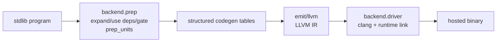

Tool entry points:

- [`tools/s2_emit.caap`](../tools/s2_emit.caap): emits LLVM IR or another named
  registered emitter.
- [`tools/s2_build.caap`](../tools/s2_build.caap): emits and links a hosted
  native binary.
- `backend.driver.compile_file`: source file to binary.
- `backend.driver.compile_ir`: AST/spec program to binary.

`boot/native_emit.caap` eagerly loads the codegen layer and registers
`stdlib.native.emit`, `stdlib.llvm.emit`, `stdlib.llvm.emit_freestanding`,
`stdlib.wasm.emit`, and `stdlib.wasm.emit_module`. It also registers the PEVAL
transform for codegen sessions. Basic tools can instead lazy-load the backend by
module name through `stdlib.load.load_module`.

### WASM Build

`backend.emit.wasm` emits WAT from the same `prep_units` tables used by LLVM.
`backend.driver_wasm` drives `wat2wasm` / runtime execution helpers.

### Freestanding / Bare-Metal Build

Freestanding builds use `backend.driver.compile_freestanding` or
`compile_surface_freestanding`. They produce ELF/object artifacts with
`-ffreestanding -nostdlib` and target metadata from `backend.driver.targets`.
`stdlib.bare.*` wrappers are intended for this path.

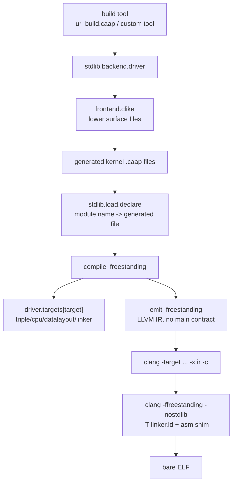

### Sys Grants

`sys/*` modules load without authority and expose typed throwing stubs. Real host
callables are minted only by explicitly executing
[`boot/sys_grants.caap`](../stdlib/boot/sys_grants.caap) under the umbrella
`sys` capability. It registers `stdlib.sys.grant.<lib>` maps that `sys/wrap.caap`
uses to partially apply capability handles.

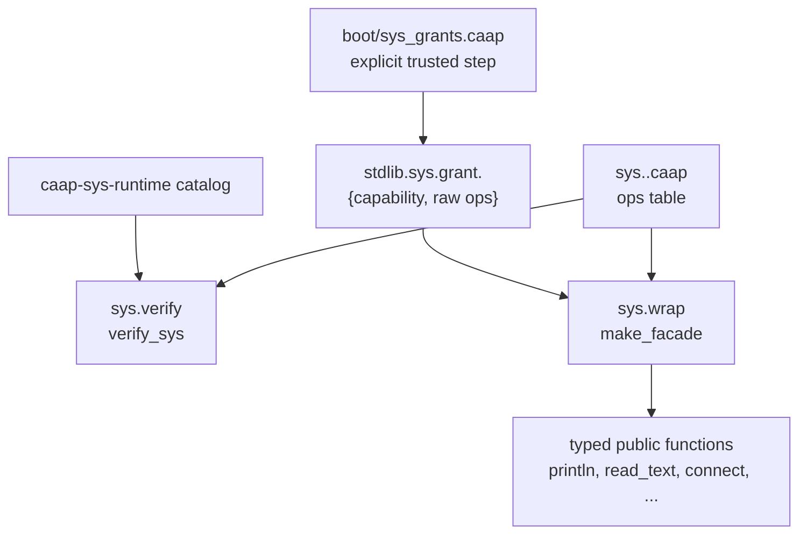

## Bootstrap And URun Deployment Walkthrough

This is the exact path for the URun vertical slice:

```bash
caap stdlib/bootstrap.caap examples/urun/ur_build.caap \
     examples/urun /tmp/urun.elf cortex-m3
```

The key distinction: `ur_build.caap` executes at compile time as a build tool;
`sample_urun.caap` and the `ur_*.caap` modules do not run on the host. They are
lowered, checked, emitted as LLVM IR, linked into a freestanding ARM ELF, and
then run by QEMU or hardware.

### Phase 1: CLI Launch

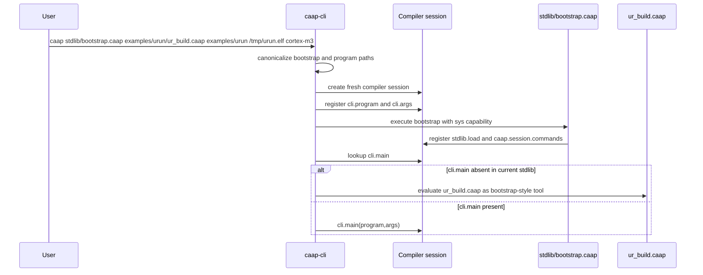

What happens here:

1. `caap-cli` sees two or more args, so it enters launcher mode:
   `BOOTSTRAP PROGRAM [ARG...]`.
2. It canonicalizes `stdlib/bootstrap.caap` and `examples/urun/ur_build.caap`.
3. It registers:
   - `cli.program = <absolute path to ur_build.caap>`;
   - `cli.args = ["examples/urun", "/tmp/urun.elf", "cortex-m3"]`.
4. It executes `stdlib/bootstrap.caap` with the `sys` capability in scope.
5. Current stdlib registers `caap.session.commands`, but does not register a
   `cli.main` policy. The CLI therefore evaluates `ur_build.caap` as a
   bootstrap-style tool in the same bootstrapped compiler session.

### Phase 2: Base Stdlib Bootstrap

For this URun command the base bootstrap is exactly the sequence described in
[Bootstrap Lifecycle](#bootstrap-lifecycle):

1. Raw execute `boot/expander.caap`.
2. Raw execute `boot/forms.caap`.
3. Expand and evaluate `check`, `namespace`, `resolve`, `gate`, `reader`,
   `unit_build`, `loader`.
4. Load `sequence`, `map`, `syntax.ast`.
5. Load `semantics/types/registry`, `records`, `effects`, `infer`.
6. Backfill signatures for modules loaded before the type pass existed.
7. Declare the `stdlib` root, so `stdlib.backend.driver` can be resolved later
   by module name.
8. Load `boot/commands.caap`.

After this, `ur_build.caap` can do:

```lisp
(bind ((lm (get (ctfe_compiler_lookup_value compiler "stdlib.load") "load_module"))
       (build (lm "stdlib.backend.driver")))
  ...)
```

### Phase 3: `ur_build.caap` Loads The Driver

`examples/urun/ur_build.caap` is intentionally a bare-kernel build script. It
does not use stdlib forms like `cond`; it uses `bind`, `do`, `if` and the
registered `stdlib.load` API.

It loads `stdlib.backend.driver` by name. That lazy load pulls the backend graph
needed for freestanding emission:

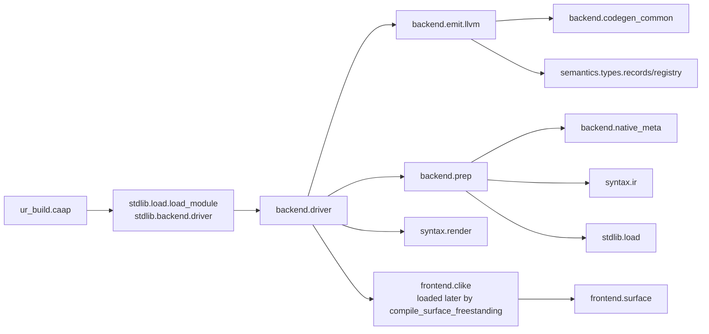

No `caap-sys-runtime` is linked for URun. Host services are used only by the
build driver at compile time to read/write files and spawn `clang`.

### Phase 4: `compile_surface_freestanding`

`ur_build.caap` calls:

```lisp
(compile_surface_freestanding
  dir
  "sample_urun.caap"
  modules
  "cortex-m3"
  "/tmp/urun.elf"
  {"shim": "examples/urun/ur_port_cortexm3.s",
   "ld":   "examples/urun/ur.ld"})
```

The `modules` list maps URun module names to source files:

| Module name | Source file | Role |
|---|---|---|
| `stdlib.urun.ur_status` | `ur_status.caap` | status enum and wait constants |
| `stdlib.urun.ur_port` | `ur_port.caap` | Cortex-M3 port primitives, UART, SysTick/PendSV setup helpers |
| `stdlib.urun.ur_scheduler` | `ur_scheduler.caap` | `UR_THREAD`, ready list, delayed list, scheduler core |
| `stdlib.urun.ur_thread` | `ur_thread.caap` | thread management API over scheduler |
| `stdlib.urun.ur_timer` | `ur_timer.caap` | tick base, timers, `_ur_timer_interrupt` |
| `stdlib.urun.ur_semaphore` | `ur_semaphore.caap` | semaphore control block and services |
| `stdlib.urun.ur_queue` | `ur_queue.caap` | queue control block and services |

The driver then performs these steps:

1. Look up target `cortex-m3` in `backend.driver.targets`.
2. Load `stdlib.frontend.clike` on demand.
3. For each dependency module:
   - read `DIR/<file>`;
   - call `clike.lower_program_at(text, path)`;
   - render lowered forms with `syntax.render.render_program`;
   - write a generated kernel source file at
     `/tmp/urun.elf.<module-name>.gen.caap`;
   - call `stdlib.load.declare(module_name, generated_path)`.
4. Lower entry `sample_urun.caap` the same way and write
   `/tmp/urun.elf.gen.caap`.
5. Merge target options with caller options:
   - `triple = thumbv7m-none-eabi`;
   - `cpu = cortex-m3`;
   - `datalayout = e-m:e-p:32:32-Fi8-i64:64-v128:64:128-a:0:32-n32-S64`;
   - `linker = lld`;
   - `shim = ur_port_cortexm3.s`;
   - `ld = ur.ld`.
6. Call `compile_freestanding(tmp_entry, out, merged_opts)`.
7. Clean all generated `.gen.caap` files on success or failure.

### Phase 5: URun Module Graph

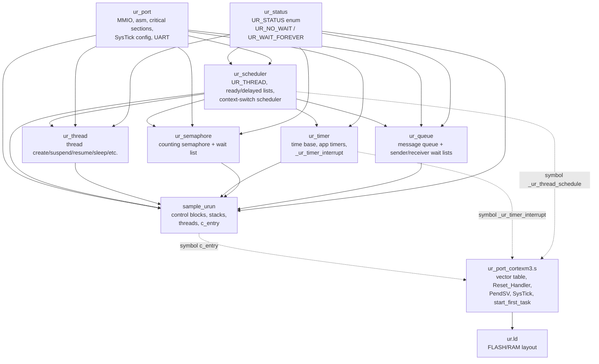

In the clike source, a named file starts with a surface header such as:

```text
(surface stdlib.frontend.clike stdlib.urun.ur_scheduler)
```

Declarations are private by default. `export` on a clike declaration becomes the
module export surface. Importing a private declaration fails during load with a
normal stdlib import/export diagnostic.

### Phase 6: Freestanding Emit

`compile_freestanding` executes inside the already-bootstrapped compiler:

1. `backend.emit.llvm.set_target!("thumbv7m-none-eabi", datalayout)`.
2. Optional strict native mode is enabled if `opts.mode == "strict"`.
3. The generated entry file `/tmp/urun.elf.gen.caap` is parsed as kernel source.
4. `emit_freestanding(unit)` runs the native path:
   - `backend.prep` expands and gates the entry;
   - `prep` resolves the entry's `use stdlib.urun.* (...)` directives through
     the `declare` records created in Phase 4;
   - dependency modules are loaded once, checked, typechecked and harvested;
   - public structs/functions/enums from modules become typed codegen facts;
   - all modules are flattened into one freestanding translation unit;
   - native-only heads such as `volatile_write`, `ptr_write`, `asm`,
     `fn_ptr`, pointer arithmetic and typed structs are accepted by the
     backend gate.
5. `emit_freestanding` returns `{text, diagnostics}` where `text` is LLVM IR.
6. Any diagnostics stop the build as data: `{ok:false, diagnostics:[...]}`.

The freestanding path has no `main`/process-exit contract. The exported runtime
entry is `c_entry`, which the assembly reset handler calls.

### Phase 7: Link The ELF

`link_bare!` turns LLVM IR into `/tmp/urun.elf`:

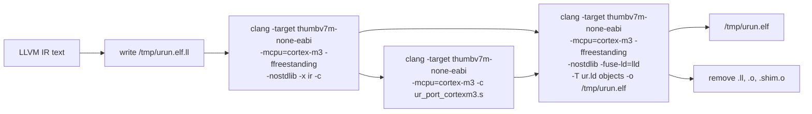

Intermediate files:

- `/tmp/urun.elf.ll`;
- `/tmp/urun.elf.o`;
- `/tmp/urun.elf.shim.o`;
- generated `.gen.caap` files from Phase 4.

They are removed on success and best-effort removed on failure. The final ELF is
the only intended artifact.

### Phase 8: Runtime Boot In QEMU

Run:

```bash
qemu-system-arm -M mps2-an385 -cpu cortex-m3 -nographic -kernel /tmp/urun.elf
```

Runtime flow:

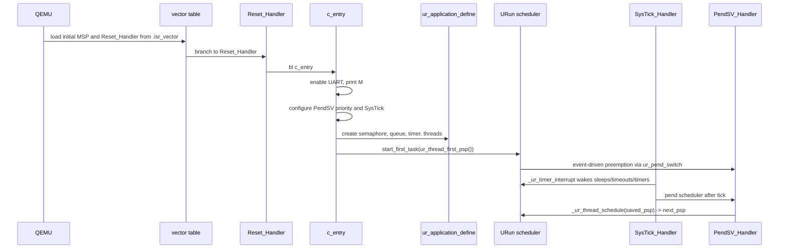

Expected UART output is:

```text
MABCPDT
```

Meaning:

- `M`: `c_entry` entered the kernel and enabled UART.
- `A`, `B`, `C`: producer posts queue/semaphore; higher-priority consumer
  preempts and prints received bytes.
- `P`: one-shot application timer fired from SysTick.
- `D`: producer woke after `ur_thread_sleep(3)`.
- `T`: consumer's timed semaphore wait expired with `UR_NO_INSTANCE`.

## Directory Responsibilities

| Directory | Responsibility | Load timing |
|---|---|---|
| `boot/` | expander, forms, checker, loader responsibilities, commands, optional grants/codegen bootstrap | base bootstrap plus optional scripts |
| `lib/` | user-facing standard libraries: collections, core, text, diagnostics, numeric, crypto, project/test/CLI helpers | lazy by module load, except `sequence`, `map` during bootstrap |
| `syntax/` | AST readers/builders, IR rewriting, renderer | `ast` eager; `ir`/`render` lazy |
| `semantics/types/` | type descriptors, marker readers, effect inference, type checking | eager after loader |
| `semantics/passes/` | optional analyses/transforms/fact store | lazy, user/codegen opt-in |
| `semantics/*.caap` | CFG/dataflow/dominators/SSA infrastructure | lazy |
| `sys/` | typed host-service facades and drift verification | lazy; real calls need grants |
| `frontend/` | opt-in surface grammar infrastructure and C-like surface | lazy |
| `backend/` | native/WASM prep, emitters and toolchain drivers | lazy |
| `storage/` | library-defined binary format compiler | lazy |
| `bare/` | native-only MMIO/CPU/atomic/sync wrappers | native codegen path only |

## Library Architecture Notes

The catalog below is the public API contract. This section explains the
architecture behind each stdlib library: value shapes, ownership boundaries,
when it runs, and which layer is allowed to call it.

### Execution Profiles

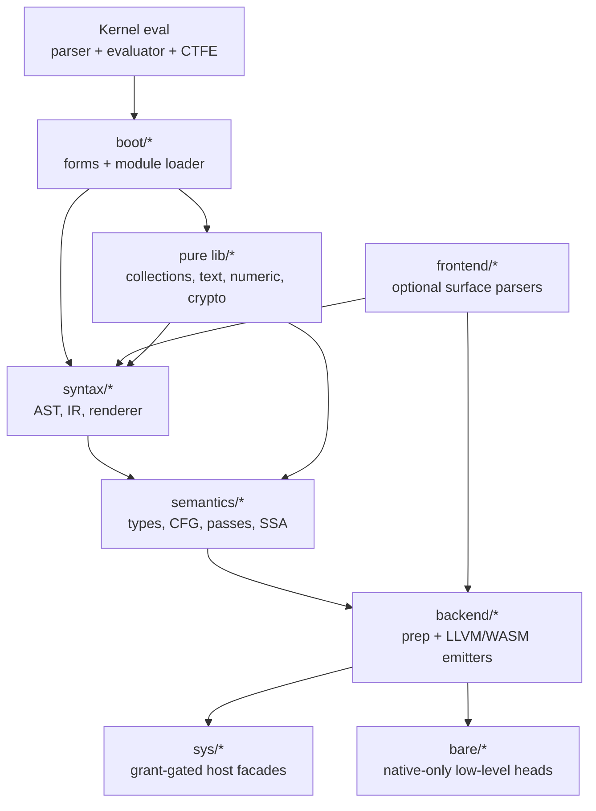

| Profile | Libraries | Architectural meaning |
|---|---|---|
| bootstrap-critical | `boot/expander`, `forms`, `check`, `namespace`, `resolve`, `gate`, `reader`, `unit_build`, `loader`, `commands` | Loaded in a fixed order from `bootstrap.caap`; they create the module system used by everything else. |
| pure data libraries | most `lib/*`, `syntax/*`, `semantics/*` | Run under normal eval with no host capabilities; state is represented as CAAP maps/lists/strings. |
| optional tooling | `boot/analyze`, `boot/run`, `semantics/passes/*`, `frontend/*` | Loaded lazily by commands, tests, analyzers, or codegen paths. |
| host-capability libraries | `sys/*`, backend drivers | Use sys host operations only after explicit grant/bootstrap registration. |
| native-only libraries | `bare/*`, native heads consumed by `backend.prep` | Not meaningful in plain eval; they are accepted by native codegen and lowered by emitters. |

### Boot And Loader Libraries

| Library | Internal architecture | Runs/consumers |
|---|---|---|
| `bootstrap.caap` | A script, not a normal module. It seeds the form expander, evaluates boot files in dependency order, loads minimum stdlib modules, then registers `caap.session.commands`. | Runs once at process start when passed as the first program file. |
| `stdlib.expand` | A CTFE form registry plus an expansion engine. Forms are handlers keyed by head name; expansion produces kernel-readable AST, optionally collecting diagnostics. Builders are small AST constructors used by form authors. | First boot layer; used by every later loaded module and by syntax transforms. |
| `boot/forms.caap` | Policy layer over the expander. It registers sugar such as `defn`, `struct`, `enum`, `cond`, `for`, and threading forms; implementation lives as handlers, while the expander owns dispatch. | Loaded immediately after the expander. |
| `stdlib.check` | Expanded-AST pass over kernel-shaped forms. It checks obvious undefined-name and arity failures before evaluation, but does not own the type system. | Called by loader gate during normal module loads. |
| `stdlib.namespace` | Namespace values are plain maps from name to binding. Merge, conflict, nesting, qualification, and dotted resolution are data operations used by both boot loader and public `lib.namespace`. | Boot-time infrastructure and normal library API. |
| `stdlib.resolve` | Resolver object built by `make`; keeps root list, module-name-to-path logic, fragment lookup, and discovery. It is stateful through closures created by the loader rather than through globals. | Called by `stdlib.load` for every module request. |
| `stdlib.gate` | Ordered phase registry. Check, type inference, and pass registry hooks are optional slots; missing optional modules degrade to no-op phases. | Runs inside `loader` after reading/expansion and before export publication. |
| `stdlib.reader` | Reader object with default CAAP read plus `(surface KIT)` dispatch. Surface kits are loaded through resolver callbacks to avoid hard boot dependency on `frontend/*`. | Runs on every file load; frontend surfaces are opt-in. |
| `stdlib.unit_build` | Takes imports, injected bindings, and module body and evaluates them into a module export map. It is the isolated "turn source into value" stage. | Called by `loader` after dependency resolution. |
| `stdlib.load` | Central orchestrator with module cache, declared roots, two-phase cycle handling, dependency graph, load log, and type backfill. It composes resolver, reader, gate, and unit builder. | The module system used by all stdlib imports. |
| `stdlib.commands` | Session command registry. Heavy tooling is represented as lazy thunks so bootstrap can finish without loading analyzers/backend. | Provides `caap.session.commands` to CLI/LSP/DAP tooling. |
| `stdlib.run` | Thin runtime command facade over `stdlib.load`. It keeps command entry points stable while loader owns the mechanics. | Lazy command load. |
| `stdlib.analyze` | LSP-oriented analyzer that returns definitions/imports/diagnostics as data. It depends on AST helpers and sequence utilities, not backend. | Lazy command load for editor tooling. |
| `stdlib.boot.opt` and `opt_O*` | Optimization-level registry. `O1/O2/O3` scripts map names to pass/transform registrations rather than embedding optimization policy in the backend. | Explicit optimization bootstrap or tests. |
| `boot/native_emit.caap` | Registry bridge that exposes native/WASM emitters as compiler values. It loads backend/frontend modules lazily and registers stable names like `stdlib.llvm.emit_freestanding`. | Native/WASM build flows, including URun. |
| `boot/sys_grants.caap` | Capability projection layer. It maps trusted host service grants into callable stdlib sys facades. | Only when a build/run path needs host IO, fs, process, time, etc. |

### Core Libraries

| Library | Internal architecture | Dependency role |
|---|---|---|
| `core.prelude` | Curated re-export facade. It owns no algorithms; it selects stable everyday names from collections, text, math, option/result, equality, and diagnostics. | User convenience import; should not become a hidden dependency sink. |
| `core.math` | Pure integer algorithms over checked kernel ints. It keeps overflow behavior explicit by using kernel arithmetic and simple loops. | Base library; no stdlib deps. |
| `core.float` | Pure float facade plus predicates/conversions. Approximate equality is explicit through `approx_eq`; no implicit tolerance policy leaks elsewhere. | Base numeric helpers. |
| `core.bits` | Bit operations over kernel integer bit builtins. Width-sensitive helpers mask/shift through checked integer operations. | Base helpers for hashing/encoding/backend tests. |
| `core.equal` | Structural equality, comparison, and hashing facade. It centralizes deep value semantics so comparators, IR matching, and ordered collections do not duplicate traversal logic. | Used by comparators and syntax/IR tooling. |
| `core.functional` | Higher-order closure combinators. Memoization owns private maps inside returned closures; callers see pure callable values. | Utility layer above kernel callables. |

### Collections Libraries

| Library | Internal architecture | Invariants |
|---|---|---|
| `collections.sequence` | List facade plus derived folds, scans, slicing, zipping, grouping, sorting, and traversal helpers. Internal accumulators are fresh lists local to a function. | Input lists are not mutated by derived helpers. |
| `collections.map` | Facade over kernel map builtins plus nested access/update helpers. `delete!` and `update!` mirror mutating kernel operations; derived helpers usually clone first. | Map keys follow kernel map key rules. |
| `collections.option` | Map-shaped sum type: `{some:true,value:v}` or `{some:false}`. Predicates are total; only explicit unwrap throws. | Dependency-free so `result` can build on it. |
| `collections.result` | Map-shaped success/error container. It bridges to/from `option` and keeps error shape helpers in one place. | Fallible APIs can return data instead of raising. |
| `collections.set` | String-keyed set encoded as map `element -> true`, with list conversion and set algebra built over sequence folds. | Appropriate when elements are legal kernel map keys. |
| `collections.dict` | Structural-key dictionary. Buckets are keyed by `value_hash`, collisions are resolved with `value_eq`, entries are stored as `[key value]` pairs. | Allows arbitrary CAAP values as keys. |
| `collections.bimap` | Two synchronized maps: `fwd` and `bwd`. Writes preserve bijection by removing stale reverse/forward entries; multimap variant stores key -> list of values. | Pure operations return fresh structures. |
| `collections.multiset` | Structural-key dictionary from element to positive count. Removing to zero deletes the key; union/sum/intersection/difference each encode distinct count arithmetic. | No stored count is `<= 0`. |
| `collections.graph` | Directed graph as adjacency map `node -> [successor...]`; queries are total for unknown nodes. DOT rendering is just a view over that shape. | Loader dependency graph uses the same shape. |
| `collections.weighted_graph` | Weighted edges plus algorithms layered over sorted queues and union-find. Dijkstra/Bellman/Kruskal stay separate from the plain graph module. | Algorithm layer, not the canonical graph shape. |
| `collections.algo` | Traversal and list algorithms composed from `graph`, `sequence`, `option`, and `result`. Traversals use deterministic node/key order. | Short-circuits on first Result/Option failure. |
| `collections.sorted` | Heap, queue, stack, and deque structures over lists plus comparator callables. Heaps own list representation; queues/stacks expose simple data maps. | Comparator contract is `-1/0/1`. |
| `collections.comparator` | Algebra over comparator functions: natural order, reverse, projection, tie-breaks, lexicographic composition. | Uses `core.equal.deep_compare` as default total order. |
| `collections.ordered_map` | Sorted list of entries plus binary search; ordered set mirrors it with sorted item list. Inserts splice lists, so lookup probes are logarithmic but updates copy list segments. | Maintains sorted order under chosen comparator. |
| `collections.union_find` | Disjoint-set maps for parents/ranks/count. Operations return updated structures while preserving representative invariants. | Used by weighted graph MST logic. |

### Text, Time, Hash, Random, UUID, CLI

| Library | Internal architecture | Boundary |
|---|---|---|
| `text.string` | Clean facade over kernel string builtins plus total parsing helpers returning `Option`. Indices are character indices. | No filesystem or locale policy. |
| `text.char` | ASCII/classification helpers over one-character strings. It is intentionally small and dependency-free. | Shared by parsers. |
| `text.path` | Lexical path manipulation implemented over strings/lists. It does not resolve symlinks, cwd, or host filesystem state. | Host-aware path ops live in `sys.path`. |
| `text.json` | Character cursor parser/stringifier/pretty printer. Parse errors are data results; encode protocol errors use structured diagnostics. | Pure JSON data conversion. |
| `text.encoding` | Byte-list codecs for hex/base64/base32/percent/UTF-8. Strings cross the byte boundary through explicit encode/decode helpers. | Validates bytes and raises protocol errors via diagnostics. |
| `text.regex` | Standalone parser to regex AST plus recursive backtracking matcher over `string_chars`. It does not use PEG and intentionally supports a bounded regex subset. | Best for short/simple patterns. |
| `text.csv` | RFC-4180-style cursor parser/emitter. Malformed quoted input returns `{ok:false,error}` rather than throwing. | Data format helper, no IO. |
| `text.toml` | TOML subset parser/emitter over nested maps/lists/scalars. Datetime tokens are represented as strings because CAAP has no native datetime value. | Pure config format helper. |
| `text.url` | Generic URI parser/builder plus ordered query pair codec. URL parts are kept raw unless caller explicitly percent-decodes. | URL policy stays caller-owned. |
| `text.format` | Formatting, padding, base rendering, and table alignment built on string helpers. | Presentation layer for diagnostics/logging/time. |
| `text.buffer` | Local mutable builder abstraction for strings and byte lists. Mutability is encapsulated in buffer values and used to avoid repeated concatenation. | Used by renderers/emitters. |
| `time` | Pure proleptic Gregorian calendar/duration/ISO-8601 arithmetic over epoch integers. It never reads the clock. | Current time belongs to `sys.time`. |
| `hash` | Non-cryptographic hashes and stable structural/content hash facade. 32-bit algorithms mask every step to stay inside checked integer semantics. | Crypto hashes live in `crypto.digest`. |
| `random` | Functional seedable LCG. Every draw returns `{value,rng}`, making randomness deterministic and replayable. | Not a CSPRNG; host randomness is `sys.rand`. |
| `uuid` | UUID bytes/string formatting plus deterministic v4/v7 generation from `random`. v7 takes timestamp explicitly so the library stays pure. | Secure generation should compose with `sys.rand`. |
| `cli` | Declarative argv parser. Specs are maps, parse output is a `Result`, and env/default coercion is caller-supplied data. | No process/env dependency. |

### Diagnostics, Tests, Generators

| Library | Internal architecture | Boundary |
|---|---|---|
| `diag.error` | Canonical structured error maps plus conversion/raise helpers. | Lowest diagnostic layer. |
| `diag.registry` | Mutable registry for diagnostic codes, owners, categories, severity, explainers, and help URLs. | Shared vocabulary for tools and bags. |
| `diag.bag` | Diagnostic collection with spans, related notes, fixits, filtering, sorting, and renderers. | Carries analyzer/pass output as data. |
| `diag.log` | Structured logging records and sinks. JSONL rendering composes with text/json helpers; memory sink keeps records in data. | Host output is caller-owned. |
| `test` | Minimal assertion library built for in-language tests. | Intended for deterministic stdlib test files. |
| `prop` | Property runner plus common generators and shrink flow. It threads deterministic `random` state and reports failures as structured errors. | Reproducible tests by seed. |
| `gen` | Generator combinator algebra. Generator shape is `(rng) -> {value,rng}` and higher-order combinators preserve that state-threading contract. | Independent from test runner. |

### Numeric And Crypto Libraries

| Library | Internal architecture | Invariants |
|---|---|---|
| `numeric.bignum` | Big integers use sign plus little-endian base-1e9 limbs: `{sign, limbs}`. Values are normalized; zero is canonical with sign `0` and empty limbs. | Pure fresh values; overflow escapes kernel int range by using limbs. |
| `numeric.decimal` | Exact fixed-point value `{mantissa:<bignum>, scale:int}` interpreted as `mantissa * 10^-scale`. Rounding policy is explicit, including half-even. | Scale is non-negative; values are not forced to minimal scale. |
| `numeric.rational` | Exact fraction `{num:<bignum>, den:<bignum>}` reduced by gcd with positive denominator. | Zero is always `0/1`. |
| `crypto.checksum` | Integrity checksums over bytes/strings, reusing `hash` where algorithms overlap and adding CRC32C/Adler32. | Not security digests. |
| `crypto.digest` | Pure SHA-256/SHA-1/MD5/HMAC over byte lists/strings with hex output. 32-bit lanes are masked because kernel ints are checked i64. | Cryptographic digest API; not a KDF by itself. |
| `crypto.kdf` | PBKDF2 and HKDF composition over HMAC-SHA-256. It owns byte-list plumbing and hex output conversion. | Deterministic pure derivation; caller owns secret handling. |

### Project And Namespace Libraries

| Library | Internal architecture | Boundary |
|---|---|---|
| `project` | Manifest-driven project loader. Manifests are maps with roots/deps/entry metadata; dependency loading is recursive with diamond de-duplication and cycle errors. | Uses loader callbacks; does not own the core loader. |
| `lib.namespace` | Public re-export of boot namespace operations. It shares the exact map-based implementation used by `stdlib.load`. | Lets user libraries compose named scopes safely. |

### Syntax, Types, And Semantics Infrastructure

| Library | Internal architecture | Consumers |
|---|---|---|
| `syntax.ast` | Single owner of AST node shape predicates, builders, walking, span helpers, and eval helpers. | Expander, analyzers, types, passes. |
| `syntax.ir` | Whole-tree transform/substitution/matching/rewrite layer. It depends on AST shape but exposes higher-level rewrite contracts. | Passes, frontend lowerers, backend prep. |
| `syntax.render` | ExprSpec/AST-to-source renderer using text buffers. | Native/WASM drivers and generated-code tests. |
| `types.registry` | Central mutable type descriptor registry for structs, aliases, enums, unions, generics, pointers, arrows, and assignability. | Type inference and backend type lowering. |
| `types.records` | Single reader for inert markers emitted by forms such as `defn`, `struct`, `alias`, `enum`, and `union`. | Prevents tuple-marker layout knowledge from spreading. |
| `types.effects` | Effect scanner and ownership/mutation tag inference. It classifies known fresh values and arg0 mutators before type settling. | Type checker and safety-oriented passes. |
| `types.infer` | Module type walker. It harvests signatures, declares/settles them in registry, and checks calls against known signatures. | Loader gate and tests. |
| `semantics.dataflow` | CFG builder plus generic forward/backward fixed-point solvers. Liveness is an instance of the generic solver. | Reaching definitions, dominators, SSA helpers. |
| `semantics.dominators` | Dominator sets, immediate dominators, and dominance frontier over CFG block IDs. | SSA construction and loop analyses. |
| `semantics.ssa` | SSA view/conversion helpers, phi representation, version maps, promotable refs, and hazard checks. | SSA-specific optimization passes. |

### Pass Libraries

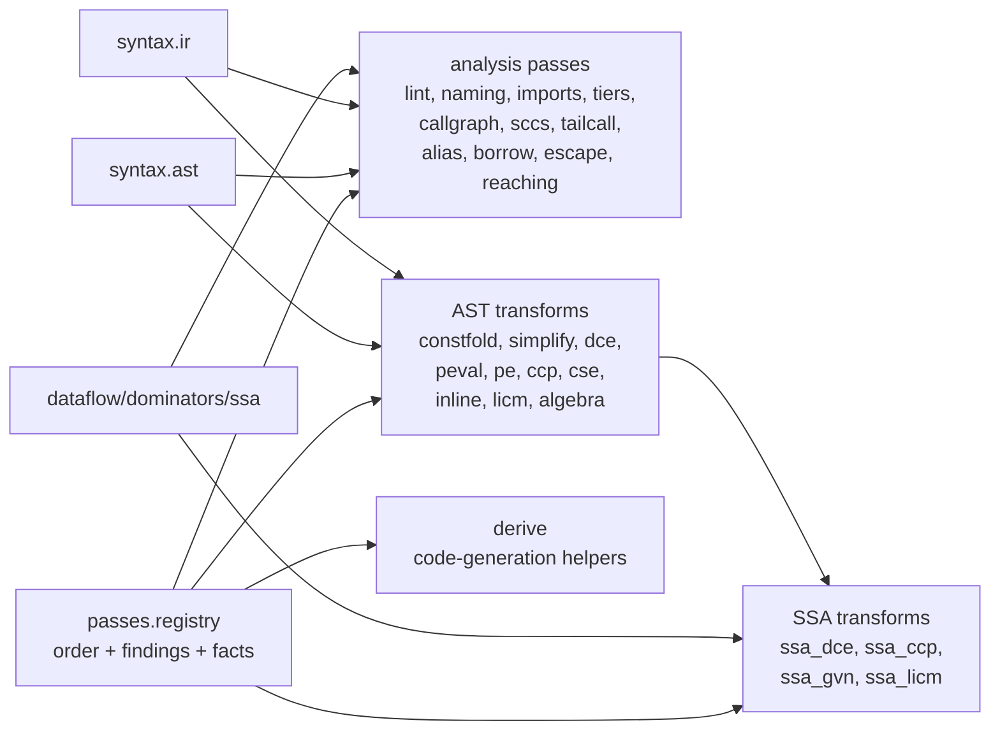

| Library | Internal architecture | Output |
|---|---|---|
| `passes.registry` | Ordered registry for analyses/transforms plus findings and typed fact store. It owns dependency ordering and pass metadata. | Findings, transformed ASTs, facts. |
| `lint` | AST/IR checks for unused names, shadowing, unreachable code, and constant conditions. | Findings. |
| `naming` | Naming policy checker, especially boolean-result naming conventions. | Findings. |
| `match_check` | Match-arm reachability and enum exhaustiveness checking. | Findings. |
| `imports` | Raw-form import/use linter before full semantic lowering. | Findings. |
| `tiers` | Layer-rank invariant checker so low tiers do not import higher tiers. | Findings. |
| `callgraph` | Extracts function call edges and reports dead definitions. | Callgraph facts/findings. |
| `sccs` | Strongly connected components over callgraph results. | Component facts. |
| `tailcall` | Tail-position and self-recursion analysis. | Tail-call facts/findings. |
| `alias` | Conservative alias/points-to class builder. | Alias facts. |
| `borrow` | Borrow/move checker layered on alias facts and ownership markers. | Borrow findings. |
| `escape` | Detects borrowed-handle escapes through returns/closures/containers. | Escape findings. |
| `reaching` | Generic dataflow instance for reaching definitions. | Reaching facts. |
| `constfold` | Rewrites literal and pure-call expressions to constants where safe. | Transformed AST. |
| `simplify` | Dead-branch, beta, and simple structural simplifications. | Transformed AST. |
| `dce` | Dead local binding elimination guarded by droppable-effect checks. | Transformed AST. |
| `peval` | Fixpoint composition of constprop/fold/simplify/DCE. | Transformed AST. |
| `pe` | Binding-time specialization forms and static marker handling. | Specialized AST. |
| `ccp` | Conditional constant propagation over AST. | Transformed AST and scalar facts. |
| `cse` | Common-subexpression elimination for safe/pure expressions. | Transformed AST. |
| `inline` | Costed lambda/call-site inlining with free-reference checks. | Transformed AST. |
| `licm` | Loop-invariant code motion with mutation/scope guards. | Transformed AST. |
| `dead_store` | Ref-use helper plus dead store elimination. | Transformed AST. |
| `algebra` | Algebraic simplifications for identity/absorbing arithmetic patterns. | Transformed AST. |
| `derive` | Derive-generator registry for show/eq/compare/hash/clone style generated members. | Generated AST declarations. |
| `ssa_dce`, `ssa_ccp`, `ssa_gvn`, `ssa_licm` | SSA-aware wrappers over DCE/CCP/GVN/CSE/LICM concepts using `semantics.ssa` views. | SSA/unified transformed AST. |

### System, Frontend, Backend, Storage, Bare

| Library | Internal architecture | Runtime boundary |
|---|---|---|
| `sys.verify` | Declarative operation signatures plus drift checker against the live host catalog. | No host call by itself. |
| `sys.wrap` | Generates typed facade functions and declaration-only stubs from `ops` tables. | Shared implementation for all sys facades. |
| `sys.io`, `sys.fs`, `sys.os`, `sys.time`, `sys.net`, `sys.process`, `sys.rand`, `sys.path` | Each module declares an `ops` table and exports generated wrappers. They do not implement IO/process/network themselves; they call granted host services. | Require sys grant/capability in trusted session. |
| `frontend.surface` | Generic grammar and lowering framework. Grammar specs are data, parser output lowers to CAAP forms/ExprSpecs. | Loaded only for `(surface ...)` or frontend tooling. |
| `frontend.clike` | C-like surface lowerer/analyzer built on `frontend.surface`, AST/IR helpers, maps/sequences, and type registry. | Optional language surface, not core syntax. |
| `backend.native_meta` | Single declarative vocabulary of native heads/types and backend support gaps. | Source of truth for native capability gating. |
| `backend.prep` | Shared pre-codegen pipeline: expands/loads dependencies, flattens units, checks native heads, builds structured codegen tables, and applies target pointer width. | Contract between semantics and emitters. |
| `backend.codegen_common` | Target-neutral classification helpers for int families, binops, comparisons, structs, pointers, and byte rendering. | Shared by LLVM and WASM emitters. |
| `backend.emit.llvm` | LLVM IR emitter for hosted and freestanding programs. It consumes prep tables and type registry metadata, then emits textual LLVM IR. | Native codegen. |
| `backend.emit.wasm` | WAT/WebAssembly emitter. It consumes the same prep/common contracts and rejects native features unsupported by WASM. | WASM codegen. |
| `backend.driver` | Toolchain driver over LLVM emitter. It writes IR, invokes clang/lld where appropriate, links hosted runtime or bare-metal objects, and cleans intermediates. | Needs host process/filesystem grants. |
| `backend.driver_wasm` | WAT/wasm driver. It emits WAT, locates wasm tooling, builds/runs modules where configured. | Needs host process/filesystem grants. |
| `storage.binary` | Declarative binary-format compiler. It parses storage specs, validates fields, generates eval readers/writers, and can render native code. | Pure compiler library; emitted code may target native. |
| `bare.mmio` | Thin wrappers over volatile native heads for memory-mapped registers and bit updates. | Native-only; no eval behavior. |
| `bare.cpu` | Inline-assembly CPU primitives for Cortex-M style barriers, wait instructions, and interrupt mask access. | Native-only. |
| `bare.critical` | Critical-section save/restore helpers built on CPU interrupt masking. | Native-only. |
| `bare.atomic` | Lock-free atomic operations over native atomic heads. | Native-only. |
| `bare.sync` | Higher-level critical-section wrappers, spinlock, and ring-buffer helpers built from `critical` and `atomic`. | Native-only synchronization layer. |

## Public Module Catalog

Legend:

- "API" lists explicit exports or registered values.
- "Deps" lists direct module dependencies from `use`, `import`, or `re_export`.
- "Registry value" means the file registers a value via
  `ctfe_compiler_register_value` instead of being a normal `(module ...)`
  import surface.

### Boot And Loader

| Surface | File | Responsibility | API | Deps |
|---|---|---|---|---|
| `stdlib.expand` | [`boot/expander.caap`](../stdlib/boot/expander.caap) | Form engine and strict/non-strict expansion. | `expand`, `expand_with`, `expand_collect`, `expand_with_diagnostics`, `define_form`, `forms` | kernel CTFE only |
| `stdlib.expand.builders` | [`boot/expander.caap`](../stdlib/boot/expander.caap) | Builder helpers for form authors. | `kname`, `kcall`, `body_spec`, `call_items`, `prepend`, `append_last`, `pair_spec`, `kbind`, `non_null_test` | kernel CTFE only |
| form registry entries | [`boot/forms.caap`](../stdlib/boot/forms.caap) | Registers language sugar/forms into `stdlib.expand`. | `const`, `cond`, `when`, `unless`, `->`, `->>`, `for`, `with_map`, `if_let`, `when_let`, `case`, `defn`, `struct`, `alias`, `enum`, `union` | `stdlib.expand`, `stdlib.expand.builders` |
| `stdlib.check` | [`boot/check.caap`](../stdlib/boot/check.caap) | Expanded-AST semantic checker for unknown names and arity. | `check_node`, `check_forms` | kernel vocabulary |
| `stdlib.namespace` | [`boot/namespace.caap`](../stdlib/boot/namespace.caap) | Directive parsing and first-class namespace-map operations. | `form_head`, `ident`, `ident_arg`, `arg_idents`, `export_map_spec`, `check_directive`, `get_export`, `ns_of`, `ns_get`, `ns_has`, `ns_keys`, `ns_merge`, `ns_merge_keep`, `ns_conflicts`, `ns_subset`, `ns_nest`, `ns_qualify`, `ns_resolve` | kernel syntax/map builtins |
| `stdlib.resolve` | [`boot/resolve.caap`](../stdlib/boot/resolve.caap) | Module name to path resolution, roots, fragments, discovery. | `make` | `stdlib.namespace` supplied by loader |
| `stdlib.gate` | [`boot/gate.caap`](../stdlib/boot/gate.caap) | Ordered load-time phase registry: check, types, passes. | `make`, `gate_phases` | `stdlib.check`, optional `semantics.types.infer`, optional `passes.registry` |
| `stdlib.reader` | [`boot/reader.caap`](../stdlib/boot/reader.caap) | Reads default CAAP or dispatches `(surface KIT)` files. | `make` returning `surface_of`, `surface_read`, `default_read` | loader-supplied `resolve_import` |
| `stdlib.unit_build` | [`boot/unit_build.caap`](../stdlib/boot/unit_build.caap) | Turns injections + body into evaluated export value. | `make` returning `build_value` | loader-supplied gate/import/export helpers |
| `stdlib.load` | [`boot/loader.caap`](../stdlib/boot/loader.caap) | Module orchestrator, cache, two-phase cycles, observability. | `load`, `load_module`, `declare`, `declare_root`, `discover`, `module_path`, `surface_of`, `dep_graph`, `load_log`, `cycles`, `backfill_types` | `stdlib.expand`, `stdlib.check`, `stdlib.namespace`, `stdlib.resolve`, `stdlib.gate`, `stdlib.reader`, `stdlib.unit_build` |
| `stdlib.commands` | [`boot/commands.caap`](../stdlib/boot/commands.caap) | Session command map and lazy tooling thunks. | `commands`, `analyze_source`, `analyze_source_with_root`, `run_source`, `run_from_root`, `run_source_checked` | `stdlib.load` |
| `stdlib.run` | [`boot/run.caap`](../stdlib/boot/run.caap) | Thin run commands for DAP/tooling. | `run_source`, `run_from_root`, `run_source_checked` | `stdlib.load` |
| `stdlib.analyze` | [`boot/analyze.caap`](../stdlib/boot/analyze.caap) | LSP-oriented definitions, imports and diagnostics as data. | `analyze_source`, `analyze_source_with_root` | `stdlib.expand`, `stdlib.syntax.ast`, `stdlib.lib.collections.sequence` |
| `stdlib.boot.opt` | [`boot/opt.caap`](../stdlib/boot/opt.caap) | Optimization-level registry and level activation. | `LEVELS`, `opt_levels`, `opt_adds`, `opt_passes`, `opt_transforms`, `valid_level?`, `level_index`, `active_opt_level`, `enable_opt!` | none |
| registry values | [`boot/native_emit.caap`](../stdlib/boot/native_emit.caap) | Optional codegen bootstrap and emitter registration. | `stdlib.native.emit`, `stdlib.llvm.emit`, `stdlib.llvm.emit_freestanding`, `stdlib.wasm.emit`, `stdlib.wasm.emit_module` | loads `syntax.render`, `core.equal`, `syntax.ir`, `backend.prep`, LLVM/WASM emitters, frontend, drivers, `peval` |
| registry values | [`boot/sys_grants.caap`](../stdlib/boot/sys_grants.caap) | Trusted sys capability projection. | `stdlib.sys.grant.io`, `fs`, `os`, `time`, `net`, `process`, `rand`, `path` | host service catalog |
| bootstrap scripts | [`boot/pe.caap`](../stdlib/boot/pe.caap), [`boot/peval.caap`](../stdlib/boot/peval.caap), `opt_O1/O2/O3` | Optional pass/optimization bootstrap entry points. | registers selected pass transforms | `stdlib.load`, pass modules |

### Core Libraries

| Module | File | Responsibility | API | Deps |
|---|---|---|---|---|
| `stdlib.lib.core.prelude` | [`lib/core/prelude.caap`](../stdlib/lib/core/prelude.caap) | Curated everyday import facade. | re-exports `map`, `filter`, `fold`, `each`, `range`, `find`, `any?`, `all?`, `take`, `drop`, `join`, `first`, `last`, `sum`, `contains?`, `flat_map`, `unique`, `partition`, `keys`, `values`, `merge`, `clone`, `entries`, `get_in`, `split`, `trim`, `concat`, `chars`, `parse_int`, `some`, `none`, `ok`, `err`, `deep_eq`, `abs`, `min`, `max`, `compose`, `pipe`, `identity`, `approx_eq`, `make_error`, `raise!`, etc. | sequence, map, string, option, result, equal, math, functional, float, diag.error |
| `stdlib.lib.core.math` | [`lib/core/math.caap`](../stdlib/lib/core/math.caap) | Integer/math helpers. | `abs`, `sign`, `min`, `max`, `clamp`, `pow`, `gcd`, `lcm`, `factorial`, `even?`, `odd?`, `pow_mod`, `isqrt`, `divmod`, `ceil_div`, `mod_inverse`, `is_prime?`, `gcd_list`, `lcm_list` | none |
| `stdlib.lib.core.float` | [`lib/core/float.caap`](../stdlib/lib/core/float.caap) | Float constants, numeric functions and predicates. | `pi`, `e`, `tau`, `sqrt`, `cbrt`, `hypot`, `pow`, `floor`, `ceil`, `round`, `trunc`, `fabs`, `fmin`, `fmax`, `clamp`, `signum`, `sign_f`, `copysign`, `lerp`, `sin`, `cos`, `tan`, `asin`, `acos`, `atan`, `atan2`, `exp`, `ln`, `log2`, `log10`, `log_base`, `expm1`, `log1p`, `sinh`, `cosh`, `tanh`, `asinh`, `acosh`, `atanh`, `is_nan?`, `is_inf?`, `is_finite?`, `deg_to_rad`, `rad_to_deg`, `approx_eq`, `to_int`, `of_int` | none |
| `stdlib.lib.core.bits` | [`lib/core/bits.caap`](../stdlib/lib/core/bits.caap) | Bit-level integer helpers. | `popcount`, `trailing_zeros`, `leading_zeros`, `ilog2`, `is_pow2?`, `bit_set?`, `set_bit`, `clear_bit`, `toggle_bit`, `rotate_left`, `rotate_right` | none |
| `stdlib.lib.core.equal` | [`lib/core/equal.caap`](../stdlib/lib/core/equal.caap) | Deep equality, ordering and structural hashing. | `deep_eq`, `deep_ne`, `deep_compare`, `structural_hash`, `deep_eq_by`, `compare_by` | none |
| `stdlib.lib.core.functional` | [`lib/core/functional.caap`](../stdlib/lib/core/functional.caap) | Higher-order combinators and memoization. | `compose`, `compose_all`, `pipe`, `pipe_all`, `partial1`, `partial2`, `curry2`, `curry3`, `uncurry2`, `juxt`, `fnil`, `identity`, `constantly`, `flip`, `complement`, `memoize`, `memoize2`, `memoize_n`, `once`, `tap` | none |

### Collections

| Module | File | Responsibility | API | Deps |
|---|---|---|---|---|
| `stdlib.lib.collections.sequence` | [`lib/collections/sequence.caap`](../stdlib/lib/collections/sequence.caap) | Pure list/sequence facade and derived operations. | `map`, `filter`, `fold`, `each`, `range`, `reverse`, `find`, `any?`, `all?`, `take`, `drop`, `count`, `join`, `zip`, `sort_by`, `length`, `empty?`, `first`, `last`, `sum`, `contains?`, `map_indexed`, `prepend`, `concat`, `pairs`, `flat_map`, `flatten`, `index_of`, `min_by`, `max_by`, `min`, `max`, `unique`, `partition`, `take_while`, `drop_while`, `reduce`, `scan`, `chunk`, `windows`, `enumerate` | none |
| `stdlib.lib.collections.map` | [`lib/collections/map.caap`](../stdlib/lib/collections/map.caap) | Pure map helpers and nested access/update. | `keys`, `values`, `merge`, `clone`, `delete!`, `update!`, `of_entries`, `has?`, `map_size`, `empty?`, `entries`, `pick`, `map_vals`, `get_in`, `assoc_in`, `keys_where`, `fold_entries`, `map_entries`, `omit`, `invert`, `filter_entries`, `merge_with`, `update_in`, `from_keys`, `map_keys_fn` | none |
| `stdlib.lib.collections.option` | [`lib/collections/option.caap`](../stdlib/lib/collections/option.caap) | Optional value container. | `some`, `none`, `option_of`, `some?`, `none?`, `option_unwrap`, `option_unwrap_or`, `option_unwrap_or_else`, `option_fold`, `option_map`, `option_map_or`, `option_filter`, `option_and_then`, `option_or`, `option_or_else`, `option_map2`, `option_zip`, `option_flatten`, `option_transpose`, `option_to_result` | none |
| `stdlib.lib.collections.result` | [`lib/collections/result.caap`](../stdlib/lib/collections/result.caap) | Success/error container. | `ok`, `err`, `ok?`, `err?`, `error_of`, `error_code`, `error_message`, `unwrap`, `unwrap_err`, `unwrap_or`, `unwrap_or_else`, `result_fold`, `result_transpose`, `map_ok`, `map_or`, `and_then`, `map_err`, `or_else`, `result_or`, `to_option`, `from_option` | option |
| `stdlib.lib.collections.set` | [`lib/collections/set.caap`](../stdlib/lib/collections/set.caap) | String-keyed set implemented over maps. | `set_of`, `set_has?`, `set_size`, `set_empty?`, `set_items`, `set_add`, `set_remove`, `set_union`, `set_intersection`, `set_difference`, `set_symmetric_difference`, `set_filter`, `set_map`, `set_fold`, `set_any?`, `set_all?`, `set_partition`, `set_subset?`, `set_superset?`, `set_equal?`, `set_disjoint?` | sequence |
| `stdlib.lib.collections.graph` | [`lib/collections/graph.caap`](../stdlib/lib/collections/graph.caap) | Directed graph as adjacency map. | `nodes`, `successors`, `has_node?`, `has_edge?`, `node_count`, `edge_count`, `predecessors`, `out_degree`, `in_degree`, `add_edge`, `add_node`, `add_edges`, `from_edges`, `transpose`, `remove_edge`, `remove_node`, `to_dot` | sequence |
| `stdlib.lib.collections.weighted_graph` | [`lib/collections/weighted_graph.caap`](../stdlib/lib/collections/weighted_graph.caap) | Weighted graph algorithms. | `wg_new`, `wg_add_edge`, `wg_add_undirected`, `wg_nodes`, `wg_edges`, `wg_to_dot`, `wg_dijkstra`, `wg_shortest_path`, `wg_bellman_ford`, `wg_kruskal_mst`, `wg_mst_weight` | sorted, union_find, sequence |
| `stdlib.lib.collections.algo` | [`lib/collections/algo.caap`](../stdlib/lib/collections/algo.caap) | General algorithms over graphs/sequences/options/results. | `bfs`, `dfs`, `reachable`, `distances`, `bfs_path`, `topo_sort`, `has_cycle?`, `scc`, `in_degree`, `connected_components`, `find_cycle`, `transitive_closure`, `fold_right`, `scan`, `chunk`, `windows`, `zip_with`, `unzip`, `group_by`, `zip`, `sort_by`, `traverse_result`, `traverse_option` | graph, sequence, result, option |
| `stdlib.lib.collections.sorted` | [`lib/collections/sorted.caap`](../stdlib/lib/collections/sorted.caap) | Heap, queue, stack, deque, comparator-driven helpers. | `int_cmp`, `invert_cmp`, `heap_new`, `heap_push`, `heap_pop`, `heap_peek`, `heap_size`, `heap_from_list`, `heapify`, `heap_is_empty?`, `heap_replace`, `heap_to_sorted_list`, `max_heap_push`, `max_heap_pop`, `queue_new`, `enqueue`, `dequeue`, `queue_peek`, `queue_size`, `queue_is_empty?`, `stack_new`, `push`, `pop`, `stack_peek`, `stack_size`, `stack_is_empty?`, `deque_new`, `push_front`, `push_back`, `pop_front`, `pop_back`, `deque_size` | sequence |
| `stdlib.lib.collections.comparator` | [`lib/collections/comparator.caap`](../stdlib/lib/collections/comparator.caap) | Comparator construction and composition. | `natural`, `reverse`, `by_key`, `by_key_with`, `then_by`, `lexicographic`, `min_with`, `max_with`, `clamp_with`, `least`, `greatest` | equal, sequence |
| `stdlib.lib.collections.dict` | [`lib/collections/dict.caap`](../stdlib/lib/collections/dict.caap) | Dictionary and hash-set-style helpers. | `dict_new`, `dict_put`, `dict_get`, `dict_has?`, `dict_del`, `dict_keys`, `dict_values`, `dict_size`, `dict_empty?`, `dict_entries`, `dict_of_pairs`, `to_map`, `of_map`, `dict_update`, `dict_merge`, `dict_map_vals`, `dict_filter`, `dict_fold`, `hset_new`, `hset_of`, `hset_add`, `hset_has?`, `hset_del`, `hset_items`, `hset_size`, `hset_empty?`, `hset_union`, `hset_intersection`, `hset_difference`, `hset_subset?` | sequence |
| `stdlib.lib.collections.bimap` | [`lib/collections/bimap.caap`](../stdlib/lib/collections/bimap.caap) | Bidirectional map and multimap helpers. | `bimap_new`, `bimap_get`, `bimap_get_key`, `bimap_has_key?`, `bimap_has_value?`, `bimap_keys`, `bimap_values`, `bimap_size`, `bimap_empty?`, `bimap_put`, `bimap_del_key`, `bimap_del_value`, `bimap_inverse`, `mm_new`, `mm_get`, `mm_add`, `mm_remove`, `mm_count`, `mm_keys`, `mm_size`, `mm_flatten` | none |
| `stdlib.lib.collections.ordered_map` | [`lib/collections/ordered_map.caap`](../stdlib/lib/collections/ordered_map.caap) | Sorted map/set over ordered key lists. | `binary_search`, `insertion_point`, `default_cmp`, `omap_new`, `omap_put`, `omap_get`, `omap_has?`, `omap_del`, `omap_keys`, `omap_values`, `omap_entries`, `omap_size`, `omap_min_key`, `omap_max_key`, `omap_floor`, `omap_ceil`, `omap_between`, `oset_new`, `oset_add`, `oset_has?`, `oset_del`, `oset_items`, `oset_size`, `oset_min`, `oset_max`, `oset_between` | sequence |
| `stdlib.lib.collections.multiset` | [`lib/collections/multiset.caap`](../stdlib/lib/collections/multiset.caap) | Multiset counters. | `ms_new`, `ms_of`, `ms_add`, `ms_add_n`, `ms_remove`, `ms_remove_n`, `ms_count`, `ms_contains?`, `ms_size`, `ms_distinct`, `ms_elements`, `ms_to_list`, `ms_most_common`, `ms_union`, `ms_sum`, `ms_intersection`, `ms_difference` | dict, sequence |
| `stdlib.lib.collections.union_find` | [`lib/collections/union_find.caap`](../stdlib/lib/collections/union_find.caap) | Disjoint-set/union-find. | `uf_new`, `uf_member?`, `uf_make_set`, `uf_find`, `uf_union`, `uf_connected?`, `uf_count`, `uf_sets` | none |

### Text, Time, Hashing, Random, UUID, CLI

| Module | File | Responsibility | API | Deps |
|---|---|---|---|---|
| `stdlib.lib.text.string` | [`lib/text/string.caap`](../stdlib/lib/text/string.caap) | String facade and derived helpers. | `split`, `trim`, `upcase`, `downcase`, `replace`, `repeat`, `lines`, `slice`, `find`, `contains?`, `starts_with?`, `ends_with?`, `concat`, `to_string`, `length`, `empty?`, `char_at`, `chars`, `pad_left`, `pad_right`, `parse_int`, `parse_float`, `rfind`, `strip_prefix`, `strip_suffix`, `splitn`, `split_whitespace`, `replace_first`, `replace_n`, `replace_last` | option |
| `stdlib.lib.text.char` | [`lib/text/char.caap`](../stdlib/lib/text/char.caap) | Character-class predicates over one-char strings. | `is_digit?`, `is_alpha?`, `is_alnum?`, `is_space?`, `is_upper?`, `is_lower?`, `is_hex_digit?`, `is_punct?`, `is_control?`, `to_upper`, `to_lower`, `hex_digit_value` | none |
| `stdlib.lib.text.path` | [`lib/text/path.caap`](../stdlib/lib/text/path.caap) | Pure lexical path manipulation. | `absolute?`, `is_relative?`, `path_join`, `normalize`, `dirname`, `basename`, `extension`, `stem`, `with_extension`, `segments`, `relpath` | sequence, string |
| `stdlib.lib.text.json` | [`lib/text/json.caap`](../stdlib/lib/text/json.caap) | Pure JSON parser/stringifier/pretty printer. | `json_parse`, `json_stringify`, `json_pretty` | diag.error, char |
| `stdlib.lib.text.csv` | [`lib/text/csv.caap`](../stdlib/lib/text/csv.caap) | CSV parser/emitter. | `csv_parse`, `csv_parse_headers`, `csv_emit`, `csv_emit_records` | none |
| `stdlib.lib.text.toml` | [`lib/text/toml.caap`](../stdlib/lib/text/toml.caap) | TOML parser/emitter. | `toml_parse`, `toml_emit` | char |
| `stdlib.lib.text.url` | [`lib/text/url.caap`](../stdlib/lib/text/url.caap) | URL and query parsing/building. | `url_parse`, `url_build`, `query_parse`, `query_build`, `url_join` | encoding, sequence |
| `stdlib.lib.text.regex` | [`lib/text/regex.caap`](../stdlib/lib/text/regex.caap) | Regex compile/search/replace/split facade. | `rx_compile`, `rx_match?`, `rx_search`, `rx_find_all`, `rx_replace`, `rx_split` | char |
| `stdlib.lib.text.encoding` | [`lib/text/encoding.caap`](../stdlib/lib/text/encoding.caap) | Hex/base64/base32/percent/UTF-8 codecs. | `hex_encode`, `hex_decode`, `base64_encode`, `base64_decode`, `base64url_encode`, `base64url_decode`, `base32_encode`, `base32_decode`, `percent_encode`, `percent_decode`, `ord`, `chr`, `utf8_encode`, `utf8_decode` | sequence, diag.error, char |
| `stdlib.lib.text.format` | [`lib/text/format.caap`](../stdlib/lib/text/format.caap) | Text formatting and alignment. | `format`, `pad_left`, `pad_right`, `center`, `format_int`, `hex`, `oct`, `bin`, `align_columns` | string |
| `stdlib.lib.text.buffer` | [`lib/text/buffer.caap`](../stdlib/lib/text/buffer.caap) | Mutable internal string/byte buffer helpers. | `buf_new`, `push`, `push_str`, `push_char`, `buf_len`, `buf_is_empty?`, `buf_clear`, `to_string`, `newline`, `push_line`, `indent`, `byte_buf_new`, `push_byte`, `push_bytes`, `to_byte_list`, `to_bytes` | diag.error |
| `stdlib.lib.time` | [`lib/time.caap`](../stdlib/lib/time.caap) | Calendar/duration/ISO-8601 helpers. | `is_leap?`, `days_from_civil`, `civil_from_days`, `day_of_week`, `datetime_from_unix`, `unix_from_datetime`, `floor_div`, `floor_mod`, `duration`, `to_seconds`, `to_minutes`, `to_hours`, `to_days`, `from_seconds`, `from_minutes`, `from_hours`, `from_days`, `duration_add`, `duration_sub`, `duration_compare`, `pad2`, `pad4`, `format_iso8601`, `parse_iso8601`, `offset_suffix`, `format_iso8601_offset`, `parse_offset_minutes`, `frac3`, `format_iso8601_millis`, `ascii_digit?`, `parse_fraction_millis`, `fraction_end`, `parse_iso8601_millis` | text.format |
| `stdlib.lib.random` | [`lib/random.caap`](../stdlib/lib/random.caap) | Deterministic PRNG and sampling helpers. | `make_rng`, `next`, `next_int`, `next_range`, `next_bool`, `next_float`, `next_gaussian`, `choice`, `weighted_choice`, `shuffle`, `sample` | none |
| `stdlib.lib.uuid` | [`lib/uuid.caap`](../stdlib/lib/uuid.caap) | UUID v4/v7 format/parse/version helpers. | `uuid_v4`, `uuid_v7`, `uuid_format`, `uuid_parse`, `uuid_version`, `uuid_valid?`, `uuid_nil`, `uuid_set_version`, `uuid_set_variant` | random |
| `stdlib.lib.hash` | [`lib/hash.caap`](../stdlib/lib/hash.caap) | Non-crypto hashes and content/structural hashes. | `fnv1a`, `fnv1a_64`, `djb2`, `crc32`, `siphash`, `siphash_keyed`, `content_hash`, `structural_hash` | sequence |
| `stdlib.lib.cli` | [`lib/cli.caap`](../stdlib/lib/cli.caap) | Command-line option specs, parser, routing and usage text. | `spec`, `flag?`, `list?`, `parse`, `route`, `route_nested`, `usage`, `option_line`, `with_env_default`, `env_key`, `coerce`, `parse_bool`, `spec_for_long`, `spec_for_short` | result |

### Diagnostics, Testing, Property Helpers

| Module | File | Responsibility | API | Deps |
|---|---|---|---|---|
| `stdlib.lib.diag.error` | [`lib/diag/error.caap`](../stdlib/lib/diag/error.caap) | Structured error values and raising. | `make_error`, `error?`, `error_code`, `error_message`, `error_data`, `with_data`, `map_data`, `raise!`, `as_error`, `with_cause`, `error_cause` | none |
| `stdlib.lib.diag.registry` | [`lib/diag/registry.caap`](../stdlib/lib/diag/registry.caap) | Diagnostic code registry. | `register_code!`, `register_code_full!`, `register_owned!`, `register_owned_full!`, `describe`, `describe_full`, `severity_of`, `category_of`, `explainer_of`, `help_url_of`, `codes`, `qualify`, `owner_of`, `local_of`, `clear!`, `codes_by_category`, `codes_by_owner` | diag.error |
| `stdlib.lib.diag.bag` | [`lib/diag/bag.caap`](../stdlib/lib/diag/bag.caap) | Diagnostic bag, spans, related notes, fixits, rendering. | `span`, `span_line`, `span_col`, `span_end_line`, `span_end_col`, `diag`, `error`, `warning`, `info`, `hint`, `with_related`, `with_fixit`, `severity_of`, `code_of`, `message_of`, `span_of`, `related_of`, `fixits_of`, `is_error?`, `make_bag`, `add!`, `entries`, `has_errors?`, `count_by_severity`, `render`, `render_related`, `render_full`, `render_all`, `bag_merge`, `errors_only`, `sort_by_span` | diag.registry |
| `stdlib.lib.diag.log` | [`lib/diag/log.caap`](../stdlib/lib/diag/log.caap) | Structured logging records and sinks. | `level_value`, `level_name`, `make_logger`, `with_field`, `with_min`, `make_record`, `log_at`, `log_trace`, `log_debug`, `log_info`, `log_warn`, `log_error`, `render_line`, `render_jsonl`, `make_memory_sink`, `logf`, `with_fields` | json, sequence, format |
| `stdlib.lib.test` | [`lib/test.caap`](../stdlib/lib/test.caap) | In-language assertion helpers. | `assert_eq`, `assert_true`, `assert_false`, `assert_ne`, `assert_nil`, `assert_throws`, `assert_approx` | none |
| `stdlib.lib.prop` | [`lib/prop.caap`](../stdlib/lib/prop.caap) | Property testing helpers and generators. | `fail!`, `assert_false`, `assert_ne`, `assert_nil`, `assert_approx`, `assert_contains`, `assert_throws`, `assert_error`, `new_rng`, `gen_int`, `gen_bool`, `gen_string`, `gen_list`, `gen_alphabet`, `shrink_candidates`, `shrink`, `forall`, `forall_seed`, `default_seed` | diag.error, random |
| `stdlib.lib.gen` | [`lib/gen.caap`](../stdlib/lib/gen.caap) | Generator combinators. | `gen_const`, `gen_int`, `gen_bool`, `gen_choose`, `gen_map`, `gen_bind`, `gen_one_of`, `gen_frequency`, `gen_tuple`, `gen_list` | random |

### Numeric And Crypto

| Module | File | Responsibility | API | Deps |
|---|---|---|---|---|
| `stdlib.lib.numeric.bignum` | [`lib/numeric/bignum.caap`](../stdlib/lib/numeric/bignum.caap) | Big integer arithmetic. | `bn_zero`, `bn_from_int`, `bn_to_int`, `bn_parse`, `bn_format`, `bn_sign`, `bn_limbs`, `bn_is_zero?`, `bn_cmp`, `bn_neg`, `bn_abs`, `bn_add`, `bn_sub`, `bn_mul`, `bn_divmod`, `bn_div`, `bn_rem`, `bn_mod`, `bn_pow`, `bn_pow_mod`, `bn_gcd`, `bn_lcm`, `bn_isqrt`, `bn_egcd`, `bn_modinv` | diag.error |
| `stdlib.lib.numeric.decimal` | [`lib/numeric/decimal.caap`](../stdlib/lib/numeric/decimal.caap) | Decimal numbers over bignum mantissa/scale. | `dec_mantissa`, `dec_scale`, `dec_make`, `dec_from_int`, `dec_zero`, `dec_parse`, `dec_format`, `dec_add`, `dec_sub`, `dec_mul`, `dec_div`, `dec_neg`, `dec_abs`, `dec_sign`, `dec_is_zero?`, `dec_cmp`, `dec_eq?`, `dec_round`, `dec_rescale` | diag.error, bignum |
| `stdlib.lib.numeric.rational` | [`lib/numeric/rational.caap`](../stdlib/lib/numeric/rational.caap) | Rational arithmetic over bignum. | `rat`, `rat_of_bn`, `rat_from_int`, `rat_num`, `rat_den`, `rat_zero`, `rat_one`, `rat_is_zero?`, `rat_sign`, `rat_add`, `rat_sub`, `rat_mul`, `rat_div`, `rat_neg`, `rat_abs`, `rat_recip`, `rat_cmp`, `rat_eq?`, `rat_to_float`, `rat_format`, `rat_parse` | diag.error, bignum |
| `stdlib.lib.crypto.checksum` | [`lib/crypto/checksum.caap`](../stdlib/lib/crypto/checksum.caap) | Checksums. | `crc32c`, `adler32`, `checksum` | sequence, hash |
| `stdlib.lib.crypto.digest` | [`lib/crypto/digest.caap`](../stdlib/lib/crypto/digest.caap) | Digest/HMAC helpers. | `sha256`, `sha1`, `md5`, `hmac` | encoding, sequence |
| `stdlib.lib.crypto.kdf` | [`lib/crypto/kdf.caap`](../stdlib/lib/crypto/kdf.caap) | Key derivation functions. | `pbkdf2_sha256`, `hkdf_sha256`, `hkdf_extract`, `hkdf_expand` | digest, encoding, sequence |

### Project And Namespace Helpers

| Module | File | Responsibility | API | Deps |
|---|---|---|---|---|
| `stdlib.lib.project` | [`lib/project.caap`](../stdlib/lib/project.caap) | Multi-file project manifests, deps and entry loading. | `load_project`, `load_entry`, `run`, `projects`, `clear_projects!`, `schema_version`, `known_keys`, `validate_manifest!` | text.path, sequence |
| `stdlib.lib.namespace` | [`lib/namespace.caap`](../stdlib/lib/namespace.caap) | Library-facing re-export of boot namespace operations. | re-exports `stdlib.namespace` operations | `stdlib.namespace` |

### Syntax And IR

| Module | File | Responsibility | API | Deps |
|---|---|---|---|---|
| `stdlib.syntax.ast` | [`syntax/ast.caap`](../stdlib/syntax/ast.caap) | AST readers/builders, spans, eval helpers. | `call?`, `name?`, `literal?`, `string_lit?`, `bool_lit?`, `int_lit?`, `float_lit?`, `lit_null?`, `name_of`, `literal_of`, `head_of`, `callee`, `head_is?`, `args_of`, `arg`, `items_of`, `bind_pairs`, `def_of`, `walk`, `span6`, `loc`, `loc_or`, `sym`, `lit`, `call`, `calln`, `lam`, `seq`, `if3`, `mkbind`, `eval_ir`, `eval_with` | none |
| `stdlib.syntax.ir` | [`syntax/ir.caap`](../stdlib/syntax/ir.caap) | Whole-tree rewriting, substitution, matching, hygiene. | `transform`, `subst`, `subst_safe`, `replace_heads`, `node_eq`, `names_used`, `names_set`, `free_names`, `gensym`, `rename_all`, `pattern_var?`, `segment_var?`, `match_node`, `rule`, `rewrite`, `rewrite_fix`, `rewrite_traced` | ast, sequence, equal, map, render |
| `stdlib.syntax.render` | [`syntax/render.caap`](../stdlib/syntax/render.caap) | ExprSpec to kernel-source renderer. | `render`, `render_program` | ast, text.buffer |

### Type System

| Module | File | Responsibility | API | Deps |
|---|---|---|---|---|
| `stdlib.semantics.types.registry` | [`semantics/types/registry.caap`](../stdlib/semantics/types/registry.caap) | Type descriptor registry, aliases, structs, enums, unions, generics. | `define_struct!`, `define_alias!`, `define_enum!`, `enum_variants`, `enum?`, `define_union!`, `union?`, `union_members`, `arrow?`, `arrow_params`, `arrow_result`, `define_type_fn!`, `elem_type`, `field`, `resolve`, `known_type?`, `field_type`, `struct?`, `sized_int?`, `int_family?`, `float_family?`, `bounds`, `literal_fits?`, `assignable?`, `pointer?`, `ptr_elem`, `type_var?`, `ctor_of`, `type_args`, `subst_type` | sequence |
| `stdlib.semantics.types.records` | [`semantics/types/records.caap`](../stdlib/semantics/types/records.caap) | Single reader for inert markers produced by `defn`/`struct`/`alias`/`enum`/`union`. | `marker?`, `sig_marker`, `alias_marker`, `enum_marker`, `union_marker`, `struct_marker`, `ctor_record`, `fn_record?`, `lambda_param_names` | ast, sequence, types.registry |
| `stdlib.semantics.types.effects` | [`semantics/types/effects.caap`](../stdlib/semantics/types/effects.caap) | Effect inference and ownership-aware mutation classification. | `vocab`, `known_tags`, `effect_state`, `effect_scan`, `inferred_tags`, `derive_effect`, `settle_effect!`, `register_fresh_head!`, `register_arg0_mutator!` | ast, records |
| `stdlib.semantics.types.infer` | [`semantics/types/infer.caap`](../stdlib/semantics/types/infer.caap) | Type walker, call checking, signature harvest and registration. | `result_types`, `param_types`, `check_module_types`, `register_sigs!`, `declare_sigs!`, `sig_of`, `sig_marker` | ast, map, registry, records, effects |

### Semantics Infrastructure

| Module | File | Responsibility | API | Deps |
|---|---|---|---|---|
| `stdlib.semantics.dataflow` | [`semantics/dataflow.caap`](../stdlib/semantics/dataflow.caap) | CFG construction and generic dataflow solvers. | `build_cfg`, `cfg_blocks`, `cfg_block`, `cfg_block_ids`, `cfg_succ`, `cfg_pred`, `cfg_entry`, `cfg_exit`, `block_stmts`, `block_id`, `solve`, `solve_forward`, `solve_backward`, `liveness`, `live_in`, `live_out`, `block_transfer_live`, `stmt_def`, `stmt_uses` | ast, ir, sequence, set |
| `stdlib.semantics.dominators` | [`semantics/dominators.caap`](../stdlib/semantics/dominators.caap) | Dominator and dominance-frontier analysis. | `dominators`, `dom_set`, `dominates?`, `strictly_dominates?`, `idom`, `idom_of`, `dominance_frontier`, `id_set_of`, `id_set_has?`, `id_set_items`, `intersect` | dataflow |
| `stdlib.semantics.ssa` | [`semantics/ssa.caap`](../stdlib/semantics/ssa.caap) | SSA conversion/view helpers and phi representation. | `to_ssa`, `from_ssa`, `supported?`, `ssa_supported?`, `is_ssa_form?`, `ssa_node`, `ssa_view`, `ssa_phis`, `ssa_version_def`, `ssa_version_uses`, `ssa_versions`, `phi`, `is_phi?`, `PHI_HEAD`, `ver_name`, `promotable_refs`, `hazardous?` | ast, dead_store, ir |

### Pass Framework And Passes

| Module | File | Responsibility | API | Deps |
|---|---|---|---|---|
| `stdlib.semantics.passes.registry` | [`semantics/passes/registry.caap`](../stdlib/semantics/passes/registry.caap) | Pass/transform registry, stable ordering, findings and fact store. | `register_pass!`, `register_pass_with!`, `unregister_pass!`, `unregister_transform!`, `install_pass!`, `install_pass_with!`, `install_transform!`, `install_transform_with!`, `clear_passes!`, `run_passes`, `loc_of`, `finding`, `finding_at`, `note!`, `ignored?`, `register_transform!`, `register_transform_with!`, `run_transforms`, `deps_of`, `no_deps`, `entry_of`, `ordered`, `list_passes`, `list_transforms`, `list_pass_order`, `list_transform_order`, `fact!`, `fact_of`, `facts_of`, `fact_schema!`, `schema_of`, `fact_typed!`, `fact_typed_of`, `fact_typed?` | ast |
| `stdlib.semantics.passes.lint` | [`semantics/passes/lint.caap`](../stdlib/semantics/passes/lint.caap) | Unused/shadow/unreachable/constant-condition checks. | `check`, `check_module`, `register!`, `check_unused`, `check_shadow`, `check_unreachable`, `check_const_cond` | ast, ir, registry, map |
| `stdlib.semantics.passes.naming` | [`semantics/passes/naming.caap`](../stdlib/semantics/passes/naming.caap) | Naming policy for boolean-returning functions. | `bool_result?`, `check_module`, `register!` | ast, sequence, registry |
| `stdlib.semantics.passes.match_check` | [`semantics/passes/match_check.caap`](../stdlib/semantics/passes/match_check.caap) | Match unreachable-arm and enum exhaustiveness checks. | `check`, `check_module`, `register!` | ast, registry |
| `stdlib.semantics.passes.imports` | [`semantics/passes/imports.caap`](../stdlib/semantics/passes/imports.caap) | Raw-form import/use linter. | `check_forms`, `check_file` | ast, ir, registry |
| `stdlib.semantics.passes.tiers` | [`semantics/passes/tiers.caap`](../stdlib/semantics/passes/tiers.caap) | Tier invariant checker. | `rank_of`, `check_forms`, `check_file` | ast, registry |
| `stdlib.semantics.passes.callgraph` | [`semantics/passes/callgraph.caap`](../stdlib/semantics/passes/callgraph.caap) | Callgraph and dead-definition analysis. | `analyze`, `check_module`, `register!` | ast, ir, registry, sequence |
| `stdlib.semantics.passes.sccs` | [`semantics/passes/sccs.caap`](../stdlib/semantics/passes/sccs.caap) | Strongly connected components over callgraphs. | `sccs`, `sorted_component`, `analyze_module`, `check_module`, `register!` | callgraph, registry, sequence |
| `stdlib.semantics.passes.tailcall` | [`semantics/passes/tailcall.caap`](../stdlib/semantics/passes/tailcall.caap) | Tail-call / self-tail-recursion analysis. | `tail_calls`, `self_tail_recursive?`, `analyze_module`, `check_module`, `register!` | ast, registry |
| `stdlib.semantics.passes.alias` | [`semantics/passes/alias.caap`](../stdlib/semantics/passes/alias.caap) | Alias/points-to classes for ownership checks. | `check`, `check_module`, `class_map`, `register!` | ast, registry |
| `stdlib.semantics.passes.borrow` | [`semantics/passes/borrow.caap`](../stdlib/semantics/passes/borrow.caap) | Borrow/move checking. | `move`, `borrow`, `borrow_mut`, `check`, `check_module`, `register!` | ast, map, registry, alias |
| `stdlib.semantics.passes.escape` | [`semantics/passes/escape.caap`](../stdlib/semantics/passes/escape.caap) | Borrowed-handle escape analysis. | `escaping`, `check`, `check_module`, `register!` | ast, ir, map, registry |
| `stdlib.semantics.passes.constfold` | [`semantics/passes/constfold.caap`](../stdlib/semantics/passes/constfold.caap) | Literal/pure call constant folding. | `fold_node`, `run`, `register!` | ast, ir, sequence, registry |
| `stdlib.semantics.passes.simplify` | [`semantics/passes/simplify.caap`](../stdlib/semantics/passes/simplify.caap) | Dead-branch and beta simplification. | `simplify_node`, `run`, `register!` | ast, ir, sequence, registry |
| `stdlib.semantics.passes.dce` | [`semantics/passes/dce.caap`](../stdlib/semantics/passes/dce.caap) | Dead code elimination for safe local bindings. | `droppable?`, `rewrite_node`, `run`, `register!` | ast, ir, sequence, registry |
| `stdlib.semantics.passes.peval` | [`semantics/passes/peval.caap`](../stdlib/semantics/passes/peval.caap) | Constprop/fold/simplify/dce fixpoint. | `constprop`, `peval_node`, `run`, `register!` | ast, ir, constfold, simplify, dce, registry |
| `stdlib.semantics.passes.pe` | [`semantics/passes/pe.caap`](../stdlib/semantics/passes/pe.caap) | Binding-time specialization forms/transforms. | `static!`, `static_of`, `clear!`, `static_in!`, `clear_in!`, `static_marker`, `run`, `register!` | ast, sequence, encoding, ir, peval, expand, registry |
| `stdlib.semantics.passes.ccp` | [`semantics/passes/ccp.caap`](../stdlib/semantics/passes/ccp.caap) | Conditional constant propagation over AST. | `ccp_node`, `run`, `register!`, `scalar_const?`, `const_value`, `const_bool` | ast, ir, constfold, registry |
| `stdlib.semantics.passes.cse` | [`semantics/passes/cse.caap`](../stdlib/semantics/passes/cse.caap) | Common subexpression elimination. | `cse_node`, `run`, `register!`, `cse_pure?`, `cse_safe_head?` | ast, ir, registry |
| `stdlib.semantics.passes.inline` | [`semantics/passes/inline.caap`](../stdlib/semantics/passes/inline.caap) | Lambda/call-site inlining. | `node_cost`, `lambda_params`, `lambda_body`, `free_refs`, `inline_call`, `inline_site`, `inline_node`, `candidate?`, `run`, `register!` | ast, ir, sequence, map, registry |
| `stdlib.semantics.passes.licm` | [`semantics/passes/licm.caap`](../stdlib/semantics/passes/licm.caap) | Loop-invariant code motion on AST. | `licm_node`, `run`, `register!`, `licm_pure?`, `pure_head?`, `collect_mutated`, `reads_mutated_ref?`, `bound_names_in`, `scope_stable?`, `has_nested_binder?`, `hygienic_hoist_name`, `replace_occurrences` | ast, ir, sequence, registry |
| `stdlib.semantics.passes.dead_store` | [`semantics/passes/dead_store.caap`](../stdlib/semantics/passes/dead_store.caap) | Dead store removal and ref-use helpers. | `pure_value?`, `dead_store_node`, `run`, `register!`, `simple_refs`, `fresh_ref_names` | ast, sequence, registry |
| `stdlib.semantics.passes.algebra` | [`semantics/passes/algebra.caap`](../stdlib/semantics/passes/algebra.caap) | Algebraic simplifications. | `droppable?`, `simplify_algebra`, `run`, `register!` | ast, ir, sequence, registry |
| `stdlib.semantics.passes.reaching` | [`semantics/passes/reaching.caap`](../stdlib/semantics/passes/reaching.caap) | Reaching definitions analysis. | `reaching`, `reaching_in`, `reaching_out`, `reaching_names`, `name_reaches?`, `site_id`, `kill_then_gen`, `step_reach!`, `run`, `register!` | dataflow, set, registry |
| `stdlib.semantics.passes.derive` | [`semantics/passes/derive.caap`](../stdlib/semantics/passes/derive.caap) | Derive-generator registry and built-in derives. | `register_derive!`, `derive_for`, `derived?`, `derives`, `reset_derives!`, `gen_show`, `gen_eq`, `gen_compare`, `gen_hash`, `gen_clone`, `register_battery!` | types.registry, diag.error, ast |
| `stdlib.semantics.passes.ssa_dce` | [`semantics/passes/ssa_dce.caap`](../stdlib/semantics/passes/ssa_dce.caap) | Dead-code elimination over SSA/unified forms. | `ssa_dce_node`, `dead_store_unified_node`, `run`, `register!` | ast, ssa, dead_store, registry |
| `stdlib.semantics.passes.ssa_ccp` | [`semantics/passes/ssa_ccp.caap`](../stdlib/semantics/passes/ssa_ccp.caap) | CCP over SSA/unified forms. | `ssa_ccp_node`, `ccp_unified_node`, `run`, `register!` | ast, ssa, ccp, constfold, registry |
| `stdlib.semantics.passes.ssa_gvn` | [`semantics/passes/ssa_gvn.caap`](../stdlib/semantics/passes/ssa_gvn.caap) | GVN/CSE over SSA/unified forms. | `ssa_gvn_node`, `cse_unified_node`, `run`, `register!` | ast, ir, ssa, cse, registry |
| `stdlib.semantics.passes.ssa_licm` | [`semantics/passes/ssa_licm.caap`](../stdlib/semantics/passes/ssa_licm.caap) | LICM over SSA/unified forms. | `ssa_licm_node`, `licm_unified_node`, `run`, `register!` | ast, ir, sequence, licm, ssa, registry |

### System Facades

| Module | File | Responsibility | API | Deps |
|---|---|---|---|---|
| `stdlib.sys.verify` | [`sys/verify.caap`](../stdlib/sys/verify.caap) | Build op declarations and verify facade vs live catalog. | `p`, `op`, `verify_facade`, `verify_sys` | none |
| `stdlib.sys.wrap` | [`sys/wrap.caap`](../stdlib/sys/wrap.caap) | Generate typed facades and declaration-only stubs. | `make_fn`, `make_facade`, `declare_ops!` | none |
| `stdlib.sys.io` | [`sys/io.caap`](../stdlib/sys/io.caap) | Standard I/O facade (compat alias `sys.io`). | `ops`, `print`, `println`, `eprint`, `eprintln`, `write`, `write_bytes`, `flush_stdout`, `flush_stderr`, `read_line`, `read_all` | sys.verify, sys.wrap |
| `stdlib.sys.fs` | [`sys/fs.caap`](../stdlib/sys/fs.caap) | Filesystem facade (compat alias `sys.fs`). | `ops`, `append_bytes`, `append_text`, `canonicalize`, `close_dir`, `close_file`, `copy_file`, `create_dir`, `create_dir_all`, `dir_list`, `exists`, `file_flush`, `file_metadata`, `file_read_all_text`, `file_read_bytes`, `file_read_line`, `file_seek`, `file_write`, `file_write_bytes`, `hard_link`, `is_dir`, `is_file`, `list_dir`, `metadata`, `open_dir`, `open_file`, `read_bytes`, `read_link`, `read_text`, `remove_dir`, `remove_dir_all`, `remove_file`, `rename`, `set_permissions`, `set_readonly`, `symlink`, `write_bytes`, `write_text` | sys.verify, sys.wrap |
| `stdlib.sys.os` | [`sys/os.caap`](../stdlib/sys/os.caap) | OS/environment facade (compat alias `sys.os`). | `ops`, `arch`, `available_parallelism`, `current_exe`, `env_get`, `env_has`, `env_keys`, `env_vars`, `family`, `getcwd`, `hostname`, `platform`, `remove_env`, `set_current_dir`, `set_env`, `temp_dir` | sys.verify, sys.wrap |
| `stdlib.sys.time` | [`sys/time.caap`](../stdlib/sys/time.caap) | Clock/sleep facade (compat alias `sys.time`). | `ops`, `monotonic_ns`, `now_unix_ns`, `sleep_ms`, `unix_millis`, `unix_seconds` | sys.verify, sys.wrap |
| `stdlib.sys.net` | [`sys/net.caap`](../stdlib/sys/net.caap) | TCP/UDP/network facade (compat alias `sys.net`). | `ops`, `accept`, `close`, `connect`, `host_port`, `is_ip`, `is_loopback`, `listen`, `local_addr`, `peer_addr`, `poll`, `read`, `read_bytes`, `resolve`, `shutdown`, `udp_bind`, `udp_recv_from`, `udp_send_to`, `write`, `write_bytes` | sys.verify, sys.wrap |
| `stdlib.sys.process` | [`sys/process.caap`](../stdlib/sys/process.caap) | Process spawning/control facade (compat alias `sys.process`). | `ops`, `args`, `close_stdin`, `id`, `kill`, `read_stderr`, `read_stdout`, `run`, `spawn`, `wait`, `wait_result`, `write_stdin` | sys.verify, sys.wrap |
| `stdlib.sys.rand` | [`sys/rand.caap`](../stdlib/sys/rand.caap) | Host randomness facade (compat alias `sys.rand`). | `ops`, `bytes`, `int`, `float`, `bool` | sys.verify, sys.wrap |
| `stdlib.sys.path` | [`sys/path.caap`](../stdlib/sys/path.caap) | Host path operations plus relative path helper (compat alias `sys.path`). | `ops`, `join`, `basename`, `dirname`, `extension`, `stem`, `with_extension`, `is_absolute`, `normalize`, `split`, `strip_prefix`, `relpath` | sys.verify, sys.wrap |

### Frontend And Surface Syntax

| Module | File | Responsibility | API | Deps |
|---|---|---|---|---|
| `stdlib.frontend.surface` | [`frontend/surface.caap`](../stdlib/frontend/surface.caap) | Generic grammar/lowering host and surface authoring helpers. | `apply_grammar!`, `parse_forms`, `parse_forms_at`, `form_to_spec`, `parse_to_specs`, `parse_text`, `template`, `grammar`, `syntax_rule`, `entry_rule`, `set_comment`, `regex`, `literal`, `token`, `rule_ref`, `named`, `many`, `many1`, `opt`, `seq`, `choice` | `stdlib.load`, sequence, syntax.ir |
| `stdlib.frontend.clike` | [`frontend/clike.caap`](../stdlib/frontend/clike.caap) | C-like/NMV opt-in surface facade; implementation lives in `frontend/clike/*`. | `lower_program`, `lower_program_at`, `analyze_program`, `register_decl_kind!`, `register_attribute!` | frontend.surface, clike grammar/program/analyze/sem_tokens/decls |

### Backend And Codegen

| Module | File | Responsibility | API | Deps |
|---|---|---|---|---|
| `stdlib.backend.native_meta` | [`backend/native_meta.caap`](../stdlib/backend/native_meta.caap) | Single declarative native head/type vocabulary. | `native_heads`, `native_types`, `head_names`, `type_names`, `backend_supports?`, `wasm_gap_of`, `native_type?` | none |
| `stdlib.backend.prep` | [`backend/prep.caap`](../stdlib/backend/prep.caap) | Shared front-end to structured codegen tables and pre-codegen gate. | `prep_program`, `prep_units`, `target_pointer_bytes`, `set_target_ptr_bytes!`, `clear_target_ptr_bytes!`, `set_strict!`, `clear_strict!`, `strict?` | expand, load, syntax.render, sequence, syntax.ir, type records, syntax.ast, native_meta, buffer |
| `stdlib.backend.codegen_common` | [`backend/codegen_common.caap`](../stdlib/backend/codegen_common.caap) | Target-neutral codegen classification and tables. | `unsigned?`, `unify_int`, `binops`, `sbinop_heads`, `sbinop_index`, `cmp_heads`, `cmp?`, `eq_ne?`, `fbinop_heads`, `byte_hex`, `ptr_struct_name`, `struct_name_of`, `pointee_of` | types.registry |
| `stdlib.backend.emit.llvm` | [`backend/emit/llvm.caap`](../stdlib/backend/emit/llvm.caap) | LLVM IR emitter and freestanding emitter. | `emit_program`, `emit_program_debug`, `emit_freestanding`, `emit_freestanding_debug`, `set_target!`, `clear_target!`, `emit_with_target` | prep, type records, types.registry, map, sequence, ast, codegen_common, buffer |
| `stdlib.backend.emit.wasm` | [`backend/emit/wasm.caap`](../stdlib/backend/emit/wasm.caap) | WAT/WebAssembly emitter. | `emit_program`, `emit_program_debug`, `emit_module`, `emit_module_debug` | prep, type records, types.registry, map, ast, codegen_common, buffer, native_meta |
| `stdlib.backend.driver` | [`backend/driver.caap`](../stdlib/backend/driver.caap) | clang/runtime hosted and freestanding build driver. | `compile_ir`, `compile_file`, `link_ir!`, `compile_freestanding`, `link_bare!`, `targets`, `compile_surface_freestanding`, `find_runtime_lib` | emit.llvm, prep, syntax.render |
| `stdlib.backend.driver_wasm` | [`backend/driver_wasm.caap`](../stdlib/backend/driver_wasm.caap) | WAT to wasm and wasm run/build helpers. | `build_wasm`, `run_wasm`, `emit_wat!`, `wat_to_wasm!`, `find_tool`, `targets` | emit.wasm, syntax.render |

### Storage

| Module | File | Responsibility | API | Deps |
|---|---|---|---|---|
| `stdlib.storage.binary` | [`storage/binary.caap`](../stdlib/storage/binary.caap) | Declarative binary-format compiler: parse, validate, eval/native generate. | `parse_storage`, `validate`, `generate`, `render_native`, `le_bytes`, `read_le`, `read_le_signed`, `be_bytes`, `read_be`, `read_be_signed`, `pow256`, `crc32`, `emit!`, `pad_bytes`, `slice_bytes` | syntax.ast, syntax.ir, syntax.render, sequence, string, buffer, expand |

### Bare-Metal Native-Only Libraries

These modules are wrappers over native/backend heads. They should be used by
native programs and inlined by `backend.prep`; plain eval loader intentionally
does not know how to execute `asm`, `volatile_*`, or `atomic_*`.

| Module | File | Responsibility | API | Deps |
|---|---|---|---|---|
| `stdlib.bare.mmio` | [`bare/mmio.caap`](../stdlib/bare/mmio.caap) | Volatile MMIO read/write and bit helpers. | `mmio_read8`, `mmio_read16`, `mmio_read32`, `mmio_read64`, `mmio_write8`, `mmio_write16`, `mmio_write32`, `mmio_write64`, `mmio_set_bits8`, `mmio_set_bits16`, `mmio_set_bits32`, `mmio_set_bits64`, `mmio_clear_bits8`, `mmio_clear_bits16`, `mmio_clear_bits32`, `mmio_clear_bits64` | native heads |
| `stdlib.bare.cpu` | [`bare/cpu.caap`](../stdlib/bare/cpu.caap) | ARM Cortex-M inline-asm CPU primitives. | `nop`, `wfi`, `wfe`, `sev`, `dmb`, `dsb`, `isb`, `irq_disable`, `irq_enable`, `primask_read`, `primask_write` | native `asm` |
| `stdlib.bare.critical` | [`bare/critical.caap`](../stdlib/bare/critical.caap) | IRQ masking critical sections. | `critical_enter`, `critical_leave`, `critical_save`, `critical_restore` | bare.cpu |
| `stdlib.bare.atomic` | [`bare/atomic.caap`](../stdlib/bare/atomic.caap) | Lock-free atomic word operations. | `atomic_load32`, `atomic_load64`, `atomic_store32`, `atomic_store64`, `atomic_add32`, `atomic_add64`, `atomic_cas32`, `atomic_cas64`, `atomic_sub32`, `atomic_sub64`, `atomic_and32`, `atomic_and64`, `atomic_or32`, `atomic_or64`, `atomic_xor32`, `atomic_xor64`, `atomic_xchg32`, `atomic_xchg64` | native atomic heads |
| `stdlib.bare.sync` | [`bare/sync.caap`](../stdlib/bare/sync.caap) | Critical-section wrappers, spinlock and ring buffer helpers. | `with_critical`, `with_critical_arg`, `spin_init`, `spin_lock`, `spin_unlock`, `spin_trylock`, `ring_init`, `ring_count`, `ring_push`, `ring_pop` | bare.critical, bare.atomic |

## Dependency Shape

High-level direct dependency graph:

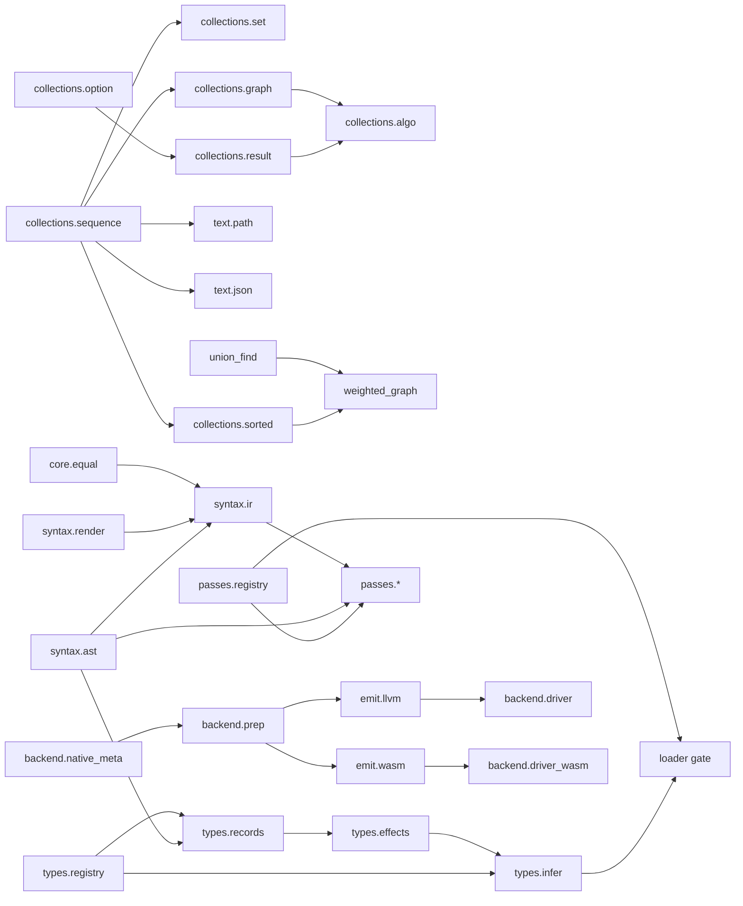

## When Things Execute

| Moment | Executes | What becomes available |
|---|---|---|
| Bare CLI `caap PROGRAM` | kernel parser/evaluator only | no stdlib names |
| Bootstrap start | `boot/expander.caap`, `boot/forms.caap` raw | `stdlib.expand`, stdlib forms |
| Bootstrap boot stack | `check`, `namespace`, `resolve`, `gate`, `reader`, `unit_build`, `loader` through expander | `stdlib.load`, module system |
| Bootstrap type load | `sequence`, `map`, `ast`, then `types/*` | type/effect pass participates in later loads |
| Bootstrap command load | `boot/commands.caap` | `caap.session.commands` |
| First module import/load | loader resolves path and runs full pipeline | module export map registered |
| First analyze/run command | `boot/analyze.caap` or `boot/run.caap` lazy load | LSP/DAP command implementation |
| First backend load | `backend/*`, `frontend/*`, `syntax.ir/render` lazy load | LLVM/WASM/native build APIs |
| Explicit sys grant | `boot/sys_grants.caap` | live typed sys facades can call host services |
| Native program prep | `backend.prep` inlines dependencies and gates code | structured codegen tables |
| Native emit/link | LLVM/WASM emitter and driver | IR/WAT/binary/ELF artifacts |

## Architectural Boundaries

- `peg/` must not depend on CAAP semantics. It is grammar machinery.
- `caap/` core should not absorb stdlib policy such as module resolution,
  optimization choice, or language surface sugar.
- `boot/expander.caap` is mechanism. `boot/forms.caap` is policy.
- `boot/loader.caap` orchestrates responsibility modules; new logic should land
  in the smallest boot responsibility that owns it.
- `syntax.ast` is the only place that should know AST node shape details.
- `semantics.types.records` is the only place that should know inert marker
  tuple layouts.
- `backend.prep` defines the codegen table contract consumed by both LLVM and
  WASM emitters.
- `sys.verify` is the drift guard for all `sys/*` facades.
- `bare/*` modules are not eval libraries. Treat them as native codegen
  libraries.

## Maintenance Checklist

When adding a module:

1. Add `(module full.name)` and explicit `(export ...)`.
2. Keep dependencies at same or lower tier.
3. Add public API to this document and to domain README/reference if relevant.
4. Add in-language `stdlib/lib/tests/test_*.caap` coverage when it is a library.
5. If it is a pass, expose `register!` only when it is meant to be opt-in.
6. If it is a sys facade, export `ops` and ensure `verify_sys` sees it.
7. If it is a backend-native head, update `backend/native_meta.caap` first.
8. If it affects bootstrap order, update the bootstrap lifecycle section above.
